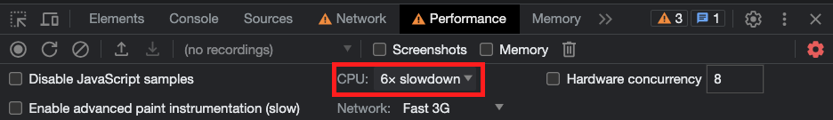
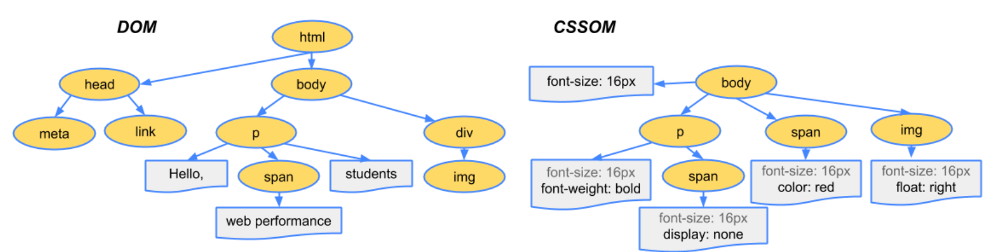

```
해당 글은 "프론트엔드 최적화 가이드"라는 도서를 기반하여 작성한 글입니다.
```

이번 글에서는 최적화 기법중 애니메이션 최적화가 무엇이고, 어떻게 적용할 수 있는지에 대하여 알아 보겠습니다.

저는 해당 도서에서 제공해주는 샘플코드를 이용하고 있으므로 샘플코드가 없으신분들은 최적화하는 과정에 대해서만 알고계서도 좋을것같습니다.

<br />

### 문제의 애니메이션 찾기

일단 최적화를 적용하기전에 어떠한 부분의 애니메이션이 문제가 있는지 살펴보겠습니다. 애니메이션이 끊기는 부분을 확인할때는 만약 컴퓨터의 성능이 좋다면 잘 느껴지지 않을 수 있습니다. 그래서 이러한 상황일때는 Performance 패널의 CPU 설정을 '6xslowdown' 으로 설정 후 해당 애니메이션이 끊기는 현상을 더 잘 확인할 수 있습니다.



애니메이션이 끊기는 현상을 쟁크(jank)라고 합니다. 샘플 코드에서 이러한 쟁크 현상이 발생하는 이유를 한번 살펴보겠습니다.

```jsx
const BarGraph = styled.div`
  ... width: ${({ width }) => width}%;
  transition: width 1.5s ease;
  ...;
`
```

위 코드를 보면 해당 애니메이션을 일으키는 속성은 `transition`이 적용된 `width` 속성입니다. 아직까지는 뭔가 확실한 이유를 잘 모르겠네요. 그러면 브라우저에서 애니메이션이 어떻게 작동하는지, 그리고 브라우저는 어떤 과정을 거쳐 화면을 그리는지 이해할 필요가 있습니다.

<br/>

### 애니메이션의 원리

애니메이션의 원리는 여러 장의 이미지를 빠르게 전환하여 우리 눈에 잔상을 남기고, 그로 인해 연속된 이미지가 움직이는 것처럼 느껴지게 하는 것입니다.

일반적으로 사용하는 디스플레이의 주사율은 60Hz입니다. 즉, 1초에 60장의 정지된 화면을 빠르게 보여 준다는 의미입니다. 따라서 브라우저도 이에 맞춰 최대 60fps로 1초에 60장의 화면을 새로 그립니다.

> 참고: 웹 브라우저에서 대부분은 60fps를 가지지만 디스플레이(모니터)에 주사율에 따라 맞춰서 적용됩니다.

만약에 애니메이션이 끊기는 현상인 쟁크 현상이 발생한 이유는 브라우저가 정상적으로 60fps로 화면을 그리지 못했기 때문이라고 유추해 볼 수 있습니다. 예를 들어 CPU가 다른 일을 하느라 바빠서 초당 60 프레임(장면)을 그리지 못하고, 40프레임, 아니면 더 적게 20프레임을 그려 애니메이션이 끊기는 느낌을 준 것입니다.

그럼 여기서 브라우저는 초당 60프레임을 그리지 못하는 이유에 대하여 살펴보겠습니다. 해당 이유를 알기 위해서는 브라우저가 화면을 그리는 과정을 알아야 합니다.

<br/>

### 브라우저 렌더링 과정

```
DOM + CSSOM > 렌더 트리 > 레이아웃 > 페인트 > 컴포지트
```

브라우저는 기본적으로 위와 같은 과정을 거쳐서 화면을 그립니다. 이러한 과정을 주요 렌더링 과정(Critical Rendering Paht) 또는 픽셀 파이브라인(Pixel Pileline)이라고 합니다.

#### DOM + CSSOM

가장 처음에는 HTML 파일과 CSS 등 화면을 그리는 데 필요한 리소스를 다운로드합니다.



HTML은 브라우저가 이해할 수 있는 형태로 변환하는 파싱과정을 거칩니다. 그리고 요소 간의 관계가 트리구조로 표현되어 있는 DOM(Document Object Model)을 만듭니다.

CSS는 HTML과 비슷한 과정을 거쳐 브라우저가 이해할 수 있는 트리 구조인 CSSOM(CSS Object Model)이 생성됩니다. CSSOM은 각 요소가 어떤 스타일을 포함하고 있는지에 대한 정보를 포함합니다.

#### 렌더 트리

렌더 트리는 DOM과 CSSOM의 결합으로 생성됩니다. 이 렌터 트리는 화면에 표시되는 각 요소의 레이아웃을 계산하는 데 사용됩니다. 그리고 `display: none`으로 설정되어 화면에 표시되지 않는 요소는 렌더 트리에 포함되지 않습니다.

> `display: none`은 렌더 트리에 포함되지 않지만, `opacity: 0` 이나 `visibility: hidden`인 요소는 렌더 트리에 포함됩니다. 이러한 속성은 사용자 눈에는 보이지 않지만 요소 자체가 없어진 것은 아니기 때문입니다.

#### 레이아웃

레이아웃 단계에서는 화면 구성 요소의 위치나 크기를 계산하고, 해당 위치에 요소를 배치하는 작업을 합니다. 즉, 화면의 레이아웃을 잡는 과정입니다.

#### 페인트

페인트 단계에서는 화면에 배치된 요소에 색을 채워 넣는 작업을 합니다. 예를 들어 배경 색을 채워 넣거나 글자 색을 결정하거나 테두리 색을 변경하는 겁니다. 이때 브라우저는 효율적인 페인트 과정을 위해 구성 요소를 여러 개의 레이어로 나눠서 작업을 합니다.

> 레이어(layer): 여러개의 층으로 나누는 개념입니다.
>
> 예를 들어 요소 A와 요소 B라는 두 개의 겹치는 요소가 있습니다. A는 *z-index: 9*를 가지며 이는 _z-index_ 속성이 없는 B보다 더 중요합니다. A는 B의 상단에 표시됩니다. 먼저 B를 페인트하고 다음 그 위에 A를 페인트합니다.
>
> 브라우저가 레이어로 나누는 기준은 다음과 같습니다.
>
> - stacking context가 있는 요소: https://developer.mozilla.org/ko/docs/Web/CSS/CSS_positioned_layout/Understanding_z-index/Stacking_context
>
> - 잘린 요소:
>
>   잘린 요소의 일반적인 사례는 오버플로우된 텍스트 요소입니다.
>
>   300px \* 300px div가 있다고 가정해 봅시다. div 상자의 긴 텍스트가 넘칩니다. div 상자를 `overflow: auto` 를 지정하면 div 내부에서 텍스트가 스크롤 가능하게 됩니다.
>
>   오버플로우된 텍스트 요소는 세 개의 레이어를 생성합니다.
>
>   - 하나는 잘라낸 텍스트를 위한 레이어로, 300px \* 300px 영역에 표시됩니다.
>   - 하나는 스크롤할 수 있도록 전체 텍스트 콘텐츠용입니다.
>   - 하나는 스크롤 막대용

#### 컴포지트

컴포지트 단계는 각 레이어를 합성하는 작업을 합니다. 페인트 단계에서 설명했듯이 브라우저는 화면을 그릴 때 여러 개의 레이어로 화면을 쪼개서 그립니다. 그런 다음 마지막에 그 레이어를 하나로 합성하는 단계가 컴포지트 단계입니다.

지금까지 브라우저 렌더링 과정에 대하여 한번 살펴보았는데 이 과정을 크롬 개발자 도구에서 Performance 패널에서 메인 스레드 작업을 살펴보면 볼 수 있습니다.

화면이 전부 그려진 후, 일부 요소의 스타일을 변경하거나 추가, 제거하게 된다면 주요 렌더링 경로에서 거친 과정을 다시 한 번 실행하면서 새로운 화면을 그립니다. 이것을 리플로우(Reflow) 또는 리페인트(Repaint)라고 합니다.

<br />

### 리플로우와 리페인트

예를 들어 처음 화면이 그려진 후, 자바스크립트로 인해 화면 내 어떤 요소의 너비와 높이가 변경이 되었을때 브라우저는 해당 요소의 가로와 세로를 다시 계산하여 변경된 사이즈로 화면을 새로 그릴 것입니다.

앞서 설명드린 주요 렌더링 경로에 대입해 보면,

1. 요소의 스타일이 변했으니 **CSSOM**을 새로 만듭니다.
2. CSSOM을 이용하여 새로운 **렌더 트리**를 만듭니다.
3. 요소의 가로와 세로를 변경했으니 **레이아웃** 단계에서 요소의 크기와 위치를 다시 고려해야 합니다.
4. 변경된 화면 구성에 맞게 **페인트** 과정을 진행하고 분할된 레이어를 하나로 합성하는 **컴포지트** 과정을 거칩니다.

위 와 같은 과정을 **리플로우**라고 합니다.

**리플로우는 주요 렌더링 경로의 모든 단계를 재실행합니다. 그렇기 때문에 브라우저 리소를 많이 사용합니다.**

이번에는 또 다른 경우를 예를 들어보겠습니다. 한 요소의 가로, 세로와 같은 레이아웃 속성이 아니라 글자 색이나 배경 색 등, 색생 관련 속성이 변경되었다고 가정해 봅시다.

1. 스타일 속성이 변경되었기 때문에 새로운 **CSSOM**이 생성됩니다.
2. CSSOM을 이용하여 **렌더 트리**가 생성됩니다.
3. 레이아웃 단계는 실행되지 않습니다. 그 이유는 변경된 내용이 색상에 관련된 내용이지 요소의 위치나 크기에 영향을 주지 않기 때문입니다.
4. 색을 입히는 **페인트** 단계 그리고 레이어를 합성하는 **컴포지트** 단계를 거칩니다.

위 와 같은 과정을 **리페인트**라고 합니다.

**리페인트 작업은 레이아웃 단계를 건너뛰었기 때문에 리플로우 작업보다는 조금 더 빠르지만, 리페인트 역시 거의 모든 단계를 거치기 때문에 리소스를 꽤 잡아먹습니다.**

리플로우와 리페인트를 발생시키는 속성

- 리플로우: position, display, width, float, height, font-familiy, top, left, font-size, font-weight, line-height, min-height, margin, padding, border 등등
- 리페인트: background, background-image, background-position, border-radius, border-style, box-shadow, color, line-style, outlint 등등

여기서 한번 정리해보면, 요소의 상태 변화가 일어나면 리플로우나 리페인트 과정을 거치는데, 이런 과정은 브라우저의 리소스를 많이 잡아먹기 떄문에 결국 화면을 새로 그리는 것이 느릴 수밖에 없다는것을 의미합니다.

리플로우와 리페인트를 피하는 방법이 있습니다. `transform`, `opacity`와 같은 속성을 사용하는 방법입니다. 이런 속성을 사용하면 해당 요소를 별도의 레이어로 분리하고 작업을 GPU에 위임하여 처리함으로써 레이아웃 단계와 페인트 단계를 건너띌 수 있습니다. 이러한 방법을 하드웨어 가속이라고 합니다.

<br/>

### 하드웨어 가속(GPU 가속)

하드웨어 가속은 CPU에서 처리해야 할 작업을 GPU에 위임하여 더욱 효율적으로 처리하는 방법입니다. GPU는 애초에 그래픽 작업을 처리하기 위해 만들어진 것이므로 화면을 그릴 때 활용하면 굉장히 빠릅니다.

특정 요소에 하드웨어 가속을 사용하려면 요소를 별도의 레이어로 분리하여 GPU로 보내야 하는데, `transform` 속성과 `opacity` 속성이 이 역활을 합니다. 분리된 레이어는 GPU에 의해 처리되어 레이아웃 단계와 페인트 단계 없이 화면상의 요소의 스타일 변경할 수 있습니다. 따라서 리플로우와 리페인트을 일으키는 `width`, `height`, `color` 등의 속성이 아닌 `transform` 또는 `opacity` 속성을 이용한 애니메이션이 성능이 더 좋을 수밖에 없습니다.

> transform: translate()는 처움부터 레이어를 분리하지 않고 변확 일어나는 순간 레이어를 분리합니다. 반면에 transform: translate3d() 또는 scale3d()와 같은 3d 속성들 또는 will-change 속성은 처음부터 레이어를 분리해 주기 때문에 변화에 더욱 빠르게 대처할 수 있습니다. 하지만 레이어가 너무 많아지면 그만큼 메모리를 많이 사용하기 때문에 주의 해야합니다.

```stylus
const BarGraph = styled.div`
    ...
    width: ${({width}) => width}%;
    transition: width 1.5s ease;
    ...
`
```

다시 샘플코드로 돌아와서 확인해보면 현재는 애니메이션을 width를 변경되도록 구현이 되어있습니다. 이렇게 되면 width가 변할 때마다 리플로우가 발생하고, 브라우저가 아주 짧은 순간마다 화면을 갱신해야 하여 모든 단계를 재시간에 처리하지 못하는 쟁크 현상이 발생하게 됩니다. 해당 문제를 해결하기 위해서는 리플로우나 리페인트가 일어나느 속성이 아닌 GPU를 활용하여 레이아웃 단계와 페인트 단계를 건너 띌 수 있는 `transfrom`같은 속성을 사용하는 것입니다.

<br/>

### 애니메이션 최적화

문제의 원인과 해결 방법을 알았으니 width로 되어 있는 애니메이션을 trasform으로 변경하여 최적화 해보겠습니다. transfrom 속성중에 scale을 사용하여 수정해보겠습니다.

```stylus
const BarGraph = styled.div`
    ...
    width: 100%;
    transform: scaleX(${({width}) => width / 100});
    transform-origin: center left;
    ...
`
```

<br/>

### 참조

---

https://cabulous.medium.com/how-does-browser-work-in-2019-part-iii-rendering-phase-i-850c8935958f
