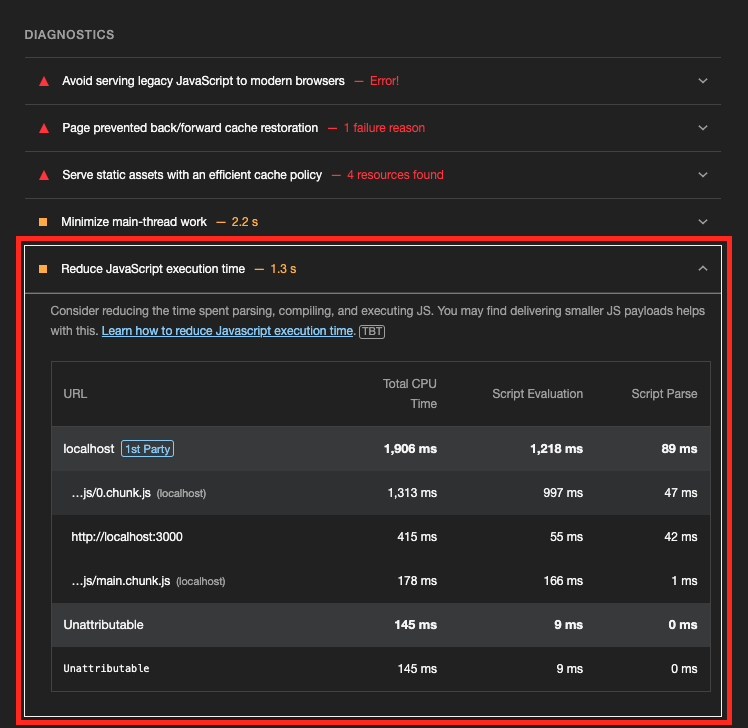
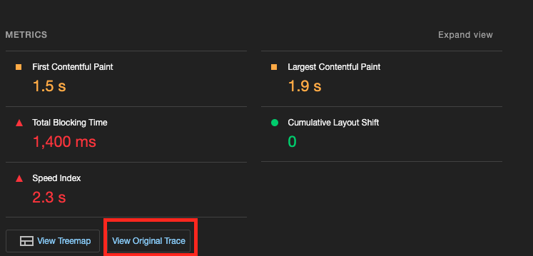
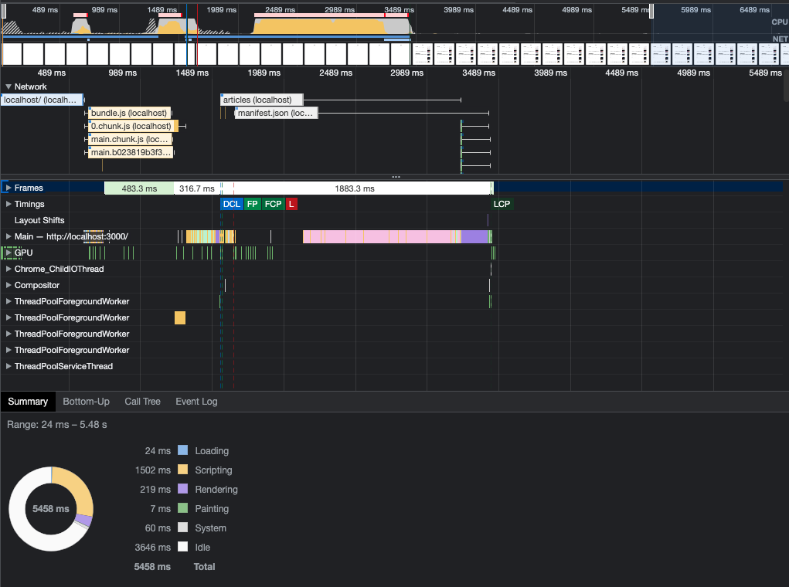
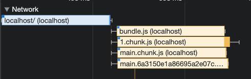
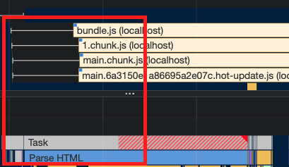
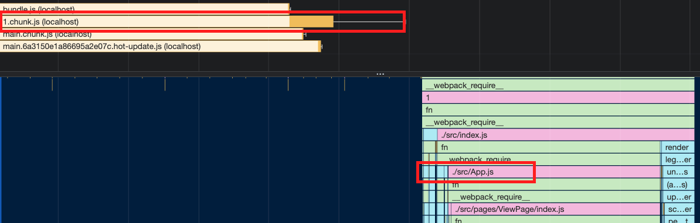
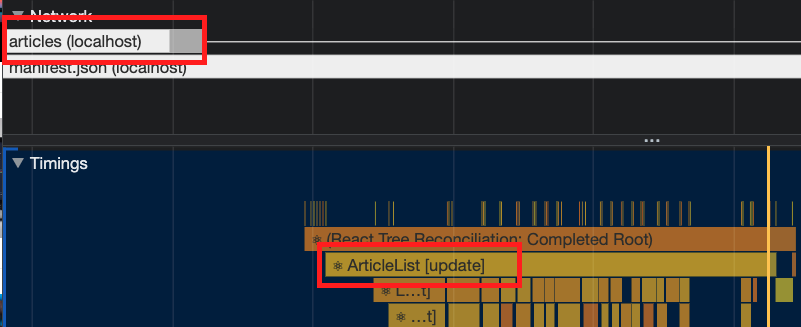

```
해당 글은 "프론트엔드 최적화 가이드"라는 도서를 기반하여 작성한 글입니다.
```

이번 글에서는 병목 코드를 어떻게 찾고 해당 코드를 최적화하는 방법에 대하여 알아보겠습니다.

> 자바스크립트 코드 때문에 서비스가 너무 느리게 다운로드되거나 느리게 실행되는 경우가 있습니다. 이처럼 서비스를 느리게 만드는 코드를 병목 코드라고 합니다.

저는 해당 도서에서 제공해주는 샘플코드를 이용하고 있으므로 샘플코드가 없으신분들은 최적화하는 과정에 대해서만 알고계서도 좋을것같습니다.

<br/>

### Performance 패널 살펴보기

병목 코드를 확인하고자하는 웹 서비스를 크롬 브라우저에서 lighthouse 툴을 이용하여 검사한 결과 항목에서 `Diagnostics` 섹션의 `Reduce Javascript execution time` 항목을 살펴보겠습니다.



해당 항목을 펼쳐 상세 정보를 확인하여 ...chunk.js 파일을 보면 1,313밀리초 동안 자바스크립트가 실행 되었음을 알 수 있습니다. 하지만 여기서 오랜동안 자바스크립트가 실행되었고 그 때문에 서비스가 느렸다는 것은 이해하였는데, 그 자바스크립트 코드가 도대체 어느 부분인지는 여기서는 알 수 없습니다. 그래서 해당 느린 작업이 무엇인지 확인하기 위해서는 **Performance 패널**을 활용할 수 있습니다.

#### Performance 패널을 활용하는 방법

첫번째는 Lighthouse 결과 페이지에 "_View Original Trace_"라는 버튼을 눌러 Performance 패널로 이동하는 방법입니다. 이 버튼을 통해 이동하면, Lighthouse를 통해 분석한 내용을 Performance 패널로 가져가서 보여 줍니다.



<br />

두번째는 직접 크롬 개발자 도구의 Performance 패널로 이동하여 분석을 진행하는 방법입니다. Performance 패널로 진입후 가장 왼쪽에 있는 새로고침 버튼을 누르면 됩니다. 그러면 페이지가 다시 로드되면서 그 과정에서의 여러 작업을 기록합니다.



Performance 패널을 이용한 분석이 완료되면 위 와 같은 화면을 볼 수 있습니다.

<br />

그러면 이제부터는 Performance 패널에 대하여 하나씩 살펴보겠습니다.

#### 1. CPU 차트, Network 차트, 스크린샷

가장 맨 위에 위치하고는 항목입니다.

CPU 차트는 시간에 따라 CPU가 어떤 작업에 리소스를 사용하고 있는지 비율로 보여 줍니다. 해당 차트를 통해 어느 타이밍에 어떤 작업이 주로 진행되고 있는지 파악할 수 있습니다. 그리고 해당 차트위에 세로줄로 있는 빨간색 선은 병목이 발생하는 지점을 의미합니다. 즉, 특정 작업이 메인 스레드를 오랫동안 잡아 두고 있다는 뜻입니다.

- 노란색: 자바스크립트 실행 작업
- 보라색: 렌더링/레이아웃 작업
- 초록색: 페인팅 작업
- 회색: 기타 시스템 작업

Network 차트는 CPU 차트 밑에 막재 형태로 표시됩니다. 대략적인 네트워크 상태를 보여줍니다.

- 위쪽 진한 막대: 우선순위가 놓은 네트워크 리소스
- 아래쪽 옅은 막대: 우선순위가 낮은 네트워크 리소스

스크리샷은 그 아래 서비스가 로드되는 과정을 스크린샷 리스트로 보여줍니다.

#### 2. Network 타임라인

Network 타임라인은 Network 패널과 유사하게 서비스 로드 과정에서의 네트워크 요청을 시간 순서로 보여줍니다.

각 네트워크 요청 막대에서 의미하는 것은 다음과 같습니다.

- 왼쪽 회색 선: 초기 연결 시간
- 막대의 옅은 색 영역: 요청을 보낸 시점부터 응답을 기다리는 시점까지의 시간(TTFB, Time to First Byte)
- 막대의 짙은 색 영역: 콘텐츠 다운로드 시간
- 오른쪽 회삭 선: 해당 요청에 대한 메인 스레드의 작업 시간

#### 3. Frames, Timings, Main

Frames 섹션은 화면의 변화가 있을 때마다 스크린샷을 찍어 보여 줍니다.

Timings 섹션은 User Timing API를 통해 기록된 정보를 기록합니다. 여기 표시된 막대들은 리액트에서 각 컴포넌트의 렌더링 시간을 측정한 것입니다.

> 리액트의 User Timing API 코드는 리액트 버전 17이후로 정확성 및 유지 보수 문제로 인해 지원이 종료 되었습니다. 해당 부분 참고 부탁드립니다.

Main 섹션은 브라우저의 메인 스레드에서 실행되는 작업을 플레임 차트로 보여줍니다. 이를 통해 어떤 작업이 오래 걸리는지 파악할 수 있습니다.

#### 4. 하단 탭

하단에 있는 Summary, Bottom-Up, Call Tree, Event Log 탭에서는 전체 또는 선택된 영역에 대한 상세 내용을 확인할 수 있습니다.

- Summary 탭: 선택 영역에서 발생한 작업 시간의 총합과 각 작업이 차지하는 비중을 보여 줍니다.
- Bottom-Up 탭: 가장 최하위에 있는 작업부터 상위 작업까지 역순으로 보여줍니다.
- Call Tree 탭: Bottom-Up과 반대로 가장 상위 작업부터 하위 작업 순으로 작업 내용을 트리뷰로 보여 줍니다.
- Event Log 탭: 발생한 이벤트를 보여 줍니다.

<br />

### 페이지 로드 과정 살펴보기



- localhost (파란색 막대): HTML 파일에 대한 요청
- bundle.js, 1.chunck.js, main.chunk.js (황색 막대): 자바스크립트 파일에 대한 요청

여기서 다른요청보다 1.chunck.js 파일의 로드 시간이 길다라는것이다. 실제로 해당 막대를 클릭에 하단에 summary 탭을 보면 파일의 크기가 4.2MB로 크다는 것을 알 수 있습니다. 지금 환경이 development 환경이라 번트 파일이 경량화되어 있지 않기 때문에 더욱 큰 것인데요. 그럼에도 너무 큰 것 같으니 해당 부분을 살펴볼 필요가 있습니다.

<br />



위 사진에서 보시다시피 HTML 파일이 다운로드되고 나서 시점을 보면 메인 스레드에서는 'Parse HTML' 이라는 작업을 하고 있습니다. 네트워크를 통해 받은 HTML을 처리하고 있는 듯합니다.

<br />



1.chunck.js의 다운로드가 끝난 시점을 보면, 이어서 자바스크립트 작업이 실행되고있습니다. 위 사진에 보시다시피 App.js 라는 항목이 보입니다. 즉, 이 작업들은 리액트 코드를 실행하는 작업이라고 볼 수 있습니다. 그리고 Timings 섹션에서 확인해보면 메인 스레드의 자바스크립트 작업이 끝나는 시점에 컴포넌트에 대한 렌더링(App[mount]) 작업이 기록되어 있는것을 확인 할 수 있습니다.

<br />



그리고 컴포넌트가 마운트되면 위 사진에서 보시다시피 Article 컴포넌트에서는 블로그 글 데이터를 네트워크를 통해 요청하는데, 그 정보가 Network 섹션에 articles (localhost) 라고 기록되어 있음을 확인할 수 있습니다. articles 데이터가 모두 다운로드되면 Timings 섹션에서 ArtcleList 컴포넌트가 렌더링 되는것을 확인할 수 있습니다. 

이제 여기서 Timings 섹션에서 ArticleList 막대를 클릭 후 하단 Summary 탭을 확인해보면 실행 시간이 1.16초라는것을 확인할 수 있습니다. 네트워크 시간을 포함한 시간이 아니라 모든 데이터가 준비된 상태에서 단순히 데이터를 화면에 그리는 것일 뿐인데 말이죠. 조금더 자세히 살펴보겠습니다.

<br />

Main 섹션에서 해당 구간을 따라가 내려가보면 'removeSpecialCharacter' 라는 작업이 보일겁니다. 해당 작업이 Article 컴포넌트의 렌더링 시간을 길어지게 했다는 이야기입니다. 즉, Article 컴포넌트가 렌더링 되는 과정에서 removeSpecialCharacter 함수가 아주 오래 실행 되었다는 뜻이고, 이 함수를 최적화하면 ArticleList의 실행 시간도 단축될 것입니다.

**지금까지 성능 최적화할 포인트를 찾는 과정을 보여드렸습니다. 해당 과정에서 저는 샘플코드를 활용하였지만 다른 서비스에서도 해당 과정과 비슷하게 병목 코드를 찾을 수 있습니다.**

### 병목 코드 개선

병목 코드인 removeSpecialCharacter 함수에 대하여 알아보겠습니다.

```javascript
function removeSpecialCharacter(str) {
  const removeCharacters = ['#', '_', '*', '~', '&', ';', '!', '[', ']', '`', '>', '\n', '=', '-'];
  let _str = str;
  let j = 0;

  for (let i = 0; i < removeCharacters.length; i++) {
    j = 0;
    
    while (j < _str.length) {
      if (_str[j] === removeCharacters[i]) {
        _str = _str.substring(0, j).concat(_str.substring(j + 1));
        continue;
      }
      
      j++;
    }
  }

  return _str;
}
```

해당 함수는 인자로 넘어온 문제열에서 특수 문자를 제거하는 함수입니다. 해당 함수를 보면 반복문을 두 번 중첩해서 사용하고 있고 문자열을 제거하는 데도 substring 과 concat 함수를 사용하고 있습니다. 그래서 해당 로직은 상장히 비효육적임을 알 수 있습니다.

그래서 해당 코드를 개선해보면 다음과 같습니다.

```javascript
function removeSpecialCharacter(str) {
  let _str = str.substring(0, 300);
  _str = str.replace(/[#_*~&;![\]'>\n=\->]/g, '');

  return _str;
}
```

<br />

최적화 전후 비교

최적화하기 전에는 1.2초 걸렸던 작업이, 14밀리초로 줄어들었습니다. 또한 Lighthouse로 검사해보면 점수가 오른 부분과 이전에 문제가 되었던 Diagmostics 섹션에서 Reduce javascript execution 항목이 사리진것을 볼수 있습니다.

<br />
