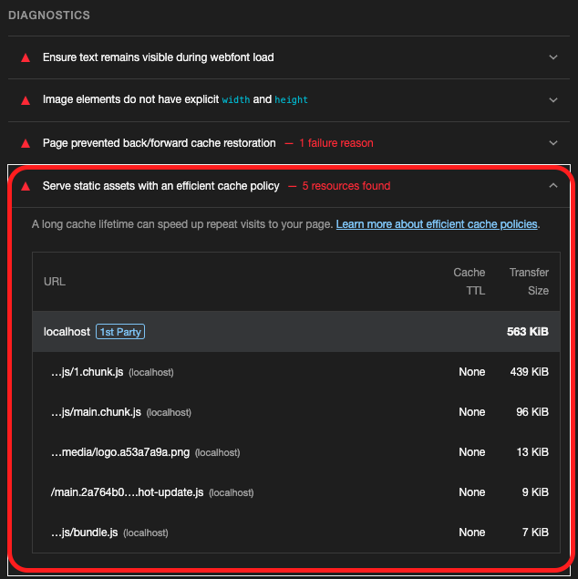
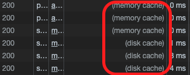
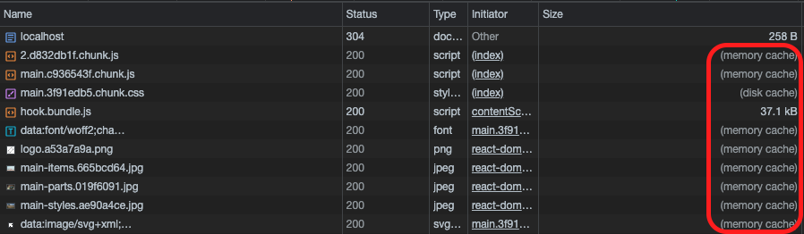
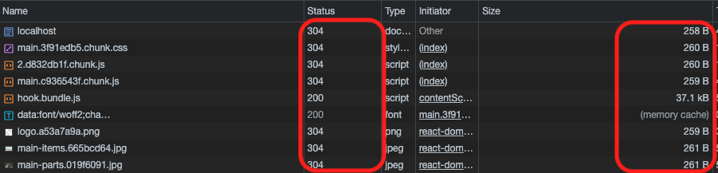

```
해당 글은 "프론트엔드 최적화 가이드"라는 도서를 기반하여 작성한 글입니다.
```

저는 해당 도서에서 제공해주는 샘플코드를 이용하고 있으므로 샘플코드가 없으신분들은 최적화하는 과정에 대해서만 알고계서도 좋을것같습니다.

<br/>

### Lighthouse를 통한 분석

해당 서비스를 Lighthouse를 사용하여 분석을 해보면 다음과 같이 결과가 나옵니다.



Diagnostics 섹션의 'Serve static assets with an efficient cache policy ' 항목이 있습니다. 이 항목은 네트워크를 통해 다운로드하는 리소스에 캐시를 적용하라는 의미입니다. 해당 항목을 열면 캐시가 적용되어 있지 않은 리소스들을 보여줍니다.

Network 패널을 통해 캐시가 적용되지 않는 리소스를 확인해보면 응답 헤더에 캐시에 대한 설절인 Cache-Control이라는 헤더가 없는 것을 확인해 볼 수 있습니다. 즉, 서버측에서 캐시 설정이 제대로 되어 있지 않은 것입니다.

<br/>

### 캐시란?!

캐시는 간단히 말하자면 자주 사용하는 데이터나 값을 미리 복사해 둔 임시 저장 공간 또는 저장하는 동작입니다. 웹에서는 서비스에서 사용하는 이미지나 자바스크립트 파일을 매번 네트워크를 통해 불러오지 않고 최초에만 다운로드하여 캐시에 저장해 두고 그 이후 요청 시에는 저장해 둔 파일을 사용합니다.

#### 캐시의 종류

웹에서 사용하는 캐시는 크게 두 가지로 구분할 수 있습니다. 메모리 캐시와 디스크 캐시입니다.

- 메모리 캐시: 메모리에 저장하는 방식. 여기서 메모리는 RAM을 의미합니다.
- 디스크 캐시: 파일 형태로 디스크에 저장하는 방식입니다.

어떤 캐시를 사용할지는 직접 제어할 수 없습니다. 브라우저가 사용 빈도나 파일 크기에 따라 특정 알고리즘에 의헤 알아서 처리합니다. 직접 확인해 볼 수도 있습니다.

- 구글 홈페이지에서 개발자 도구 열기
- Network 패널 확인
- 여러 리소스들에서 Size 항목에 **memory cache** or **disk cache** 라고 표시됩니다.



캐시가 적용된 리소스의 응답 헤더를 보면 Cache-Control이라는 헤더가 들어 있는 것을 볼 수 있습니다. 이 헤더는 서버에서 설정되면, 이를 통해 브라우저는 해당 리소스를 얼마나 캐시할지 판단합니다.

> 구글에서 단순 새로고침을 한 후 확인했다면 memory cache가 많을 것입니다. 왜나하면 이미 구글의 리소스가 메모리에 캐시 되었기 때문입니다. 브라우저를 완전히 종료한 후 구글에 접속하는 첫 네트워크 리소스를 확인하면 disk cache가 많을 것입니다. 브라우저가 완전히 종료되면 메모리에 있는 내용은 제거하고 다음 접속 때는 파일 형태로 남아 있는 캐시를 활용하기 때문입니다.

<br/>

### Cache-Control

Cache-Control은 리소스의 응답 헤더에 설정되는 헤더입니다. 브라우저는 서버에서 이 헤더를 통해 캐시를 어떻게, 얼마나 적용해야 하는지 판단합니다. Cache-Control에는 대표적으로 5가지 값이 조합되어 들어갑니다.

- no-cache: 캐시를 사용하기 전 서버에 검사 후 사용
- no-store: 캐시 사용 안함
- public: 모든 환경에서 캐시 사용 가능
- private: 브라우저 환경에서만 캐시 사용, 외부 캐시 서버에서는 사용 불가
- Max-age: 캐시의 유효 시간

no-cache는 이름만 보면 캐시를 사용하지 않는것 처럼 보이지만 이 옵션은 캐시를 사용하지 않는 것이 아니라, 사용 전에 서버에 캐시된 리소스를 사용해도 되는지 한 번 체크하도록 하는 옵션입니다. 캐시를 사용하지 않는 옵션은 no-store입니다.

public과 private으로 설정하면 max-age에서 설정한 시간만큼은 서버에 사용 가능 여부를 묻지 않고 캐시된 리소스를 바로 사용합니다. 만갸 유효 시간이 지났다면 서버에 캐시된 리소스를 사용해도 되는지 다시 체크하고 유효 시간만큼 더 사용합니다. public과 private의 차이는 캐시 환경에 있습니다. 웹 리소스는 브라우저뿐만 아니라 웹 서버와 브라우저 사이를 연결하는 중간 캐시 서버에서도 캐시될 수 있습니다. 만약 중간 서버에서 캐시를 적용학 싶지 않다면 private 옵션을 사용합니다.

max-age는 초 단위로 얼마나 오래 캐시를 사용할 것인지 설정합니다. 만약 max-age=60이라면 60초 동안 캐시를 사용한다는 의미인 것입니다.

- Cache-Control: max-age=60
  - 60초 동안 캐시를 사용합니다. private 옵션이 없으므로 기본 값인 public으로 설정되어 모든 환경에서 캐시를 합니다.
- Cache-Control: private, max-age=600
  - 브라우저 환경에서만 600초 동안 캐시를 사용합니다.
- Cache-Control: public, max-age=0
  - 모든 환경에서 0초 동안 캐시를 사용합니다. 여기서 0초는 사실상 캐시가 바로 만료되는 상태이므로 매번 서버에 캐시를 사용해도 되는지 확인을 합니다. 즉, no-cache와 동일한 설정이라고 볼 수 있습니다.

<br/>

### 캐시 적용

앞서서 설명드린것처럼 캐시는 응답 헤더에서 Cache-Control 헤더를 통해 설정된다고 했습니다. 여기서 **중요한 것은 응답 헤더는 서버에서 설정해 준다는 것입니다.** 이번글에서는 서버 샘플 코드를 이용하여 적용해보겠습니다. (서버는 노드 서버입니다.)

서버측에서 응답 헤더에 Cache-Control에 max-age=10으로 적용해보겠습니다.

```javascript
res.setHeader('Cache-Control', 'max-age=10');
```

그리고 캐시를 적용후에 브라우저에 Network 패널을 확인해보면 다음과 같이 캐시가 적용된것을 볼 수 있습니다.



이전 캐시 유효 시간을 10초를 설정을 하였는데 만약에 10초가 지난후에 새로고침을 하면 어떻게 될까요?



위와 같이 Network 패널을 보면 Size 항목에는 memory cache가 없어지고 Status 항목에는 304로 변경되어진 것을 확인 할 수 있습니다. 왜냐하면 캐시 유효 시간이 만료되면서 브라우저는 기존에 캐시된 리소스를 그대로 사용해도 될지, 아니면 리소스를 새로 다운로드해야 할지 서버에 확인하기 때문입니다. 이번글에서는 서비스의 각 리소스가 변경되지 않아 브라우저에 캐시되어 있는 리소스를 그대로 사용해도 무방하기 때문에, 서버에서는 변경되지 않았다는 304 상태 코드를 응답으로 보냈습니다.

그러면 먼가 이상한점은 캐시된 리소스를 그대로 사용하였는데도 불구하고 리소스의 Size가 260B로 기록된 이유는 캐시를 사용해도 되는지 확인하기 위해 네트워크 요청을 보내고 응답을 받았기 때문입니다.

#### 캐시된 리소스와 서버의 최신 리소스가 같은지 다른지 어떻게 체크할까?

캐시 유효 시간이 만료되면 브라우저는 캐시된 리소스를 계속 사용해도 될지 서버에 확인합니다. 이때 서버에서는 캐시된 리소스의 응답 헤더에 있는 Etag값과 서버에 있는 최신 리소스의 Etag 값을 비교하여 캐시된 리소스가 최신인지 아닌지, 즉, 계속 사용해도 되는지 아닌지 판단합니다. 만약 서버에 있는 리소스가 변했다면 Etag 값이 달라지고, 서버는 새로운 Etag 값과 함께 최신 리소스를 브라우저로 다시 보내줍니다.

<br/>

### 적절한 캐시 유효 시간

모든 리소스에 동일한 캐시 설정이 적용되면 효율적이지 않습니다. 그 이유는 리소스마다 사용이나 변경 빈도가 달라 캐시의 유효 시간도 달라져야 하기 때문입니다.

일반적으로 HTML 파일에는 no-cache 설정을 적용합니다. 항상 최신 버전의 웹서비스를 제공하기 위해서입니다. HTML이 캐시되면 캐시된 HTML에서 이전 버전의 자바스크립트나 CSS를 로드하게 되므로 캐시 시간 동안 최신 버전의 웹 서비스를 제공하지 못합니다. 따라서 항상 최신 버전의 리소스를 제공하면서도 변경 사항이 없을 때만 캐시를 사용하는 no-cache 설정을 적용합니다.

빌드된 자바스크립트나 CSS는 파일명에 해시를 함께 가지고 있습니다(main.bb0ji21.js). 즉, 코드가 변경되면 해시도 변경되어 완전히 다른 파일이 되어 버립니다. 따라서 캐시를 아무리 오래 적용해도 HTML만 최신 상태라면 자바스크립트나 CSS 파일은 당연히 최신 리소스를 로드할 것입니다.

<br/>
