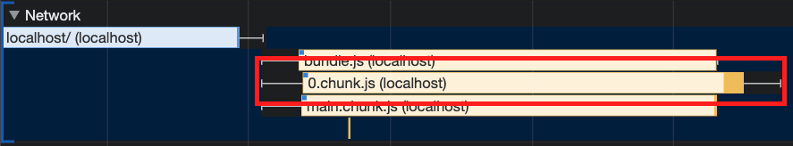
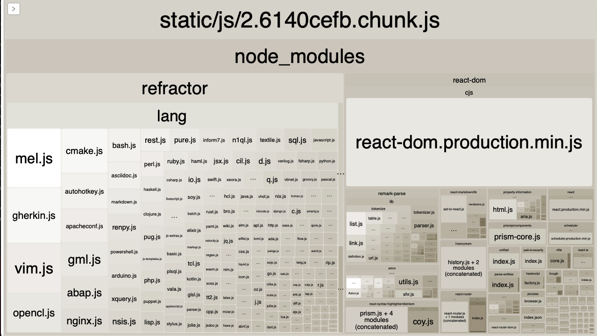
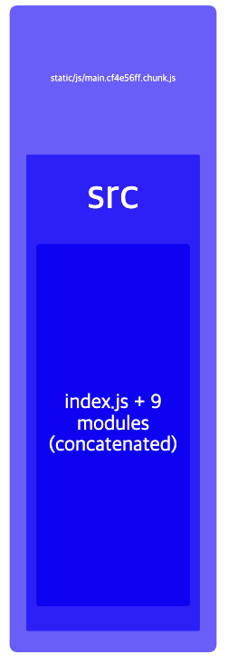
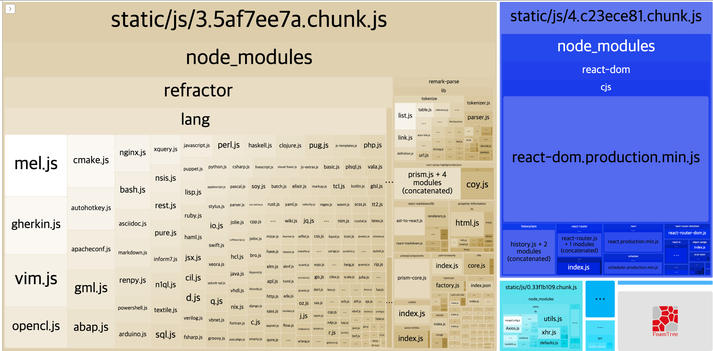
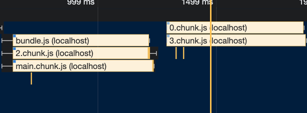

```
해당 글은 "프론트엔드 최적화 가이드"라는 도서를 기반하여 작성한 글입니다.
```

이번 글에서는 코드 분할 그리고 지연 로딩 관련한 최적화 기법에 대하여 설명드리겠습니다.

저는 해당 도서에서 제공해주는 샘플코드를 이용하고 있으므로 샘플코드가 없으신분들은 최적화하는 과정에 대해서만 알고계서도 좋을것같습니다.

<br/>

### 번들 파일 분석

Performance 패널의 검사 내용을 볼때 가장 크고 다운로드가 오래 걸린 자바스크립트 파일이 하나 있습니다. 0.chunck.js 파일입니다. 



화면을 그리는 데 필요한 리소스의 다운로드가 늦어지면, 다운로드가 완료된 후에나 화면을 그릴 수 있기 때문에 다운로드가 오래 걸린만큼 화면도 늦게 뜬다는 문제가 있습니다. 이때 자바스크립트 파일을 최적화 해보겠습니다.

<br />

가장 먼저 해당 자바스크립트 파일이 어떤 코드로 이루어져 있는지 알아야 합니다. 이 청크 파일의 구성을 상세히 보기 위해 Webpack Bundle Analyzer 툴을 이용할 수 있습니다.

> 해당 툴은 webpack을 통해 번들링된 번들 파일이 어떤 코드로 이루어져 있는지 트리뱁으로 시각화하여 보여 줍니다.  
> https://www.npmjs.com/package/webpack-bundle-analyzer

<br />

그런데 여기서 한가지 문제점은 해당 툴(Webpack Bundle Analyzer)을 사용하려면 webpack 설정을 직접 해야 한다는 것입니다. 예를 들어 Create React App 으로 프로젝트를 구성 하였다면 webpack에 대한 설정이 숨겨저 있으므로 `npm run eject` 를 이용해 설정 파일들을 추출해야 하거나 react-app-rewired 나 craco 같은 툴을 이용하는 방법이 있습니다. 이 부분은 더 간편하게 번들 사이즈를 분석할 수 있게 도와주는 cra-bundle-analyzer 툴을 사용할 수 있습니다.

> https://www.npmjs.com/package/cra-bundle-analyzer  
> 해당 툴을 사용하는 방법은 위 링크를 참고 부탁드립니다.

<br />

해당 툴을 사용하명 아래와 같이 보실 수 있습니다.



**파일의 실제 크기에 따라 비율로 보여 주기 때문에, 어떤 패키지가 어느 정도의 용량을 차지하고 있는지도 쉽게 알 수 있습니다.**      

분석한 결과를 살펴보면, 가장 많은 부분을 차지하고 있는것은 static/is/2.6140cefb.chunk.js(이하 2.chunk.js 로 부르겠습니다.) 파일이 보입니다. 비중과 이름을 봤을때 앞서 Performance 패널에서 분석할 때 용량이 크고 다운로드가 느린 0.chunk.js 파일과 동일한 번들  파일이라고 유추할 수 있습니다. 그리고 바로 하위에 있는 node_modules 는 npm을 통해 설치한 외부 라이브러리라는 것을 알 수 있습니다. 

<br />

 

분석 결고 오른쪽 상단에 보면 위 사진과 같이 파란색 블록이 보일겁니다. 그 안의 이름들로 유추해 봤을때, 서비스에서 작성된 코드임을 알 수 있습니다. 해당 번들된 파일 이름은 static/js/main.cf4e56ff.chunk.js(이하 main.chunck.js로 부르겠습니다.)

여기서 한번 정리하면 직접 작성한 서비스 코드는 main.chunck.js라는 이름으로, 외부 모듈은 2.chuck.js라는 이름으로 번들링되었습니다. 

그래서 다시 본론으로 돌아와 어떤 패키지 때문에 2.chunck.js 파일이 큰 것인지 확인해 보면, 해당 파일이 내부에는 크게 refactor 와 react-dom 이 큰 비중을 차지 하고 있습니다. 그러면 react-dom은 리액트를 위한 코드이브로 생략하고, refractor 패키지의 출처를 확인해 봅시다.

<br />

패키지 출처는 package-lock.json 파일에 명시되어 있습니다. `npm install` 을 하면 package-lock.json을 참조해서 설치하고자 하는 패키지가 어떤 버전의 패키지에 의존성이 있는지 확인해서 함께 설치해줍니다.

그러면 refractor 패키지를 package-lock.json 파일이에서 `cmd + f`를 눌러 해당 내용에 대한 것을 찾아보겠습니다.

```javascript
"react-syntax-highlighter": {
  "version": "12.2.1",
  "resolved": "https://registry.npmjs.org/react-syntax-highlighter/-/react-syntax-highlighter-12.2.1.tgz",
  "integrity": "sha512-CTsp0ZWijwKRYFg9xhkWD4DSpQqE4vb2NKVMdPAkomnILSmsNBHE0n5GuI5zB+PU3ySVvXvdt9jo+ViD9XibCA==",
  "requires": {
    "@babel/runtime": "^7.3.1",
    "highlight.js": "~9.15.1",
    "lowlight": "1.12.1",
    "prismjs": "^1.8.4",
    "refractor": "^2.4.1"
  }
}
```

찾아보니 react-syntax-highlighter 패키지에서 refractor를 참조하고 있는것이 보입니다. 

> react-syntax-highlighter는 마크다운의 코드 블록에 스타일을 입히는 데 사용되는 라이브러리입니다.

잠깐, 여기서 생각해보면 react-syntax-highlighter 패키지는 마크다운을 표시하는 데 필요하니 이번 샘플코드에서는 글 목록을 보여주는 페이지에서는 필요가 없다는것을 알 수 있습니다. 그래서 굳이 처음 진입하는데에서는 해당 패키지를 다운로드 할 필요가 없습니다. 

*하나로 합쳐져 있는 이 번들 파일을 페이지별로 필요한 내용만 분리하여 필요 할때만 따로따로 로드하면 좋을것 같습니다.*   

<br />

### 코드 분할이란

페이지에서 필요한 코드만 따로 로드하면 불필요한 코드를 로드하지 않아 더욱 빨라진다는 것은 알았습니다. 그러면 지금부터는 어떻게 필요한 코드를 따로 로드를 해야 하는 방법에 대하여 알아보겠습니다.

코드 분할(Code Splitting) 기법을 이용해서 페이지별로 코드를 분리할 수 있습니다. 코드 분할 기법은 하나의 번들 파일을 여러 개의 파일로 쪼개는 방법입니다. 

그리고 분할된 코드는 사용자가 서비스를 이용하는 중 해당 코드가 필요해지는 시점에 로드되어 실행됩니다. 이것을 지연 로딩이라고 합니다.

추가로 코드 분할 기법에는 여러 가지 패턴이 있습니다. 페이지별로 코드를 분할할 수도 있고 각 페이지가 공통으로 사용하는 모듈이 많고 그 사이즈가 큰 경우에는 페이지별로 분할하지 않고 모듈별로 분할할 수도 있습니다. 물론 그 밖에도 다양한 방식으로 코드를 분할할 수 있지만, 핵심은 *불필요한 코드 또는 중복되는 코드 없이 적절한 사이즈의 코드가 적절한 타이밍에 로드되도록 하는것* 입니다.  

### <br />

### 코드 분할 적용하기

#### 동적 import 사용하기

기본적으로 import는 다음과 같이 특정 모듈을 불러올 때 사용됩니다.

```javascript
import { add } from './math';
```

위 처럼 사용하면 해당 모듈은 빌드 시에 함께 번들링이 됩니다.

```javascript
import('add').then((module) => {
	const { add } = module;
});
```

위 와 같이 import 문을 사용하면 빌드할 때가 아닌 런타임에 해당 모듈을 로드합니다. 그것을 동적(dynamic) import라고 합니다.

webpack은 동적 import 구문을 만나면 코드를 분할하여 번들링합니다. 하지만 이 방식에는 한가지 문제가 있습니다. 동적 impot 구문은 Promise 형태로 모듈을 반환해 준다는 것입니다. import하려는 모듈은 컴포넌트이기 때문에 Promise 내부에서 로드된 컴포넌트를 Promise 밖으로 빼내야 합니다.

리액트에서는 이러한 문제를 해결하기 위해 lazy 와 Suspense를 제공합니다. 이 함수를 이용하면 비동기 문제를 신경 쓰지 않고 간편하게 동적 import를 할 수 있습니다. 예시 코드는 다음과 같습니다.

```jsx
import React, { Suspense } from 'react';

const SomeComponent = React.lazy(() => import('./SomeComponent'));

function MyComponent() {
  return (
  	<div>
    	<Suspense fallback={<div>로딩중...</div>}>
        <SomeComponent />
      </Suspense>
    </div>
  );
}
```

<br/>

***여기까지 코드분할 & 지연로딩을 하기위해 번들링된 파일을 분석하고 어떤 파일을 분할하면 될지 알아보고 해당 파일을 어떻게 코드분할 할지, 즉 코드 분할 방법에 대하여 알아보았습니다.***

<br/>

이제 부터는 샘플코드 기반으로 코드 분할 작업 내용입니다.   

```jsx
import React, { Suspense, lazy } from 'react';
import { Switch, Route } from 'react-router-dom';
import './App.css';
// import ListPage from './pages/ListPage/index';
// import ViewPage from './pages/ViewPage/index';

const ListPage = lazy(() => import('./pages/ListPage/index'));
const ViewPage = lazy(() => import('./pages/ViewPage/index'));

function App() {
  return (
    <div className="App">
      <Suspense fallback={<div>로딩중...</div>}>
        <Switch>
          <Route path="/" component={ListPage} exact />
          <Route path="/view/:id" component={ViewPage} exact />
        </Switch>
      </Suspense>
    </div>
  );
}
```

이렇게 하면 각 페이지 컴포넌트가 분할되고, 사용자가 목록 페이지에 접근했을 때 전체 코드가 아닌 ListPage 컴포넌트의 코드만 동적으로 import하여 화면을 띄웁니다.

그러면 이제 번들된 결과를 다시 확인해 보겠습니다.



- static/js/3.5af7ee7a.chunk.js: refractor를 포함하는 react-syntax-highlighter 사용하고 있는 페이지에 대한 번들 파일
- static/js/0.33f1b109.chunk.is:  react-syntax-highlighter를 사용하지 않는 글 목록페이지에 대한 번들 파일

<br />



Performance 패널도 같이 한번 확인해보겠습니다. 이전에 없던 다른 자바스크립트 파일이 추가되었고 이전에는 4.2MB 였던 파일의 크기가 1.9MB로 감소하였습니다. 그리고 다운로드 시간도 감소하였습니다.

<br/>
