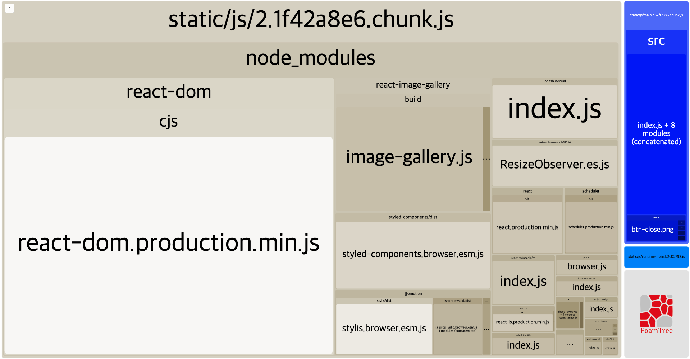
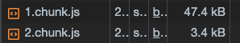
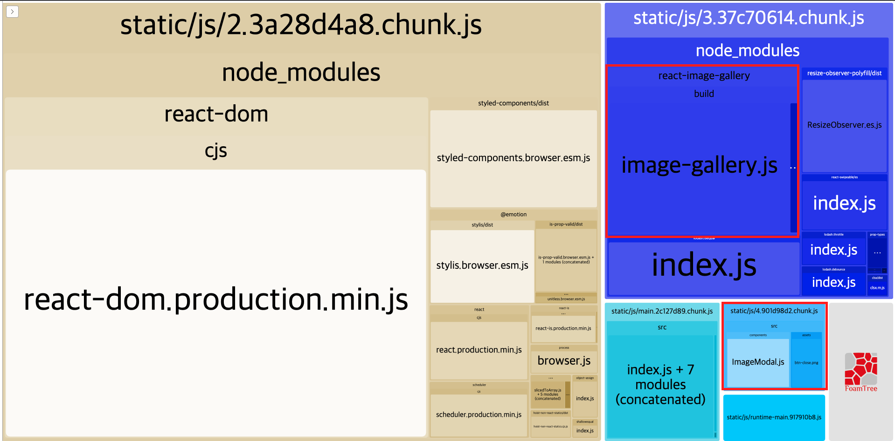

```
해당 글은 "프론트엔드 최적화 가이드"라는 도서를 기반하여 작성한 글입니다.
```

저는 해당 도서에서 제공해주는 샘플코드를 이용하고 있으므로 샘플코드가 없으신분들은 최적화하는 과정에 대해서만 알고계서도 좋을것같습니다.

컴포넌트 지연 로딩에 대하여 간략하게 어떤건지 알아보겠습니다. 단일 컴포넌트를 코드 분할을 하여 해당 컴포넌트가 쓰이는 순간에 불러도록 하는 작업입니다.

<br />

### 번들 파일 분석

먼저 컴포넌트 지연 로딩 작업을 진행하기 전에 적용해야할 서비스에 어떤 문제가 있는지 파악하기 위해 번들 파일을 분석해 보겠습니다. 분석 툴은 CRA를 사용한 프로젝트는 `cra-bundle-ananlyzer` 툴을 사용하고 직접 webpack을 통해 구성했다면 `webpack-bundle-analyzer`툴을 사용하면 됩니다.

저는 CRA를 통해 구성하여서 `cra-bundle-ananlyzer` 툴을 사용하겠습니다. 그러면 해당 툴을 다음과 같이 설치하고 실행해보겠습니다.

> 해당 툴 사용법은 다음 링크를 참고해주세요.  
>
> https://www.npmjs.com/package/cra-bundle-analyzer

해당 툴을 실행하면 다음과 같은 화면을 볼 수 있습니다.



분석된 결과를 하나씩 살펴보겠습니다. `static/js/2.1f42a86.chunk.js`(간략히 `2.chunck.js`로 부르겠습니다.) 블록은 `node_modules`에 있는 라이브러리 코드를 담고 있는 청크입니다. 그리고 오른쪽 파란색 블록은 해당 서비스의 코드입니다. 그리고 `2.chunck.js`의 포함된 내용들을 보면 `react-dom, styles-components` 그리고 `react-image-gallery`라는 외부 라이브러리를 포함하고 있습니다.` react-image-gallery`에 커서를 올려두면 대략적인 사이즈를 알 수 있는데 26KB 정도로 나옵니다. 그런데 `react-image-gallery`는 해당 샘플코드 서비스에 첫 화면부터 필요하지 않습니다. 이 라이브러리가 필요한 시점은 사진 갤러리가 포함된 화면이 나올때입니다.

그러면 해당 `react-image-gallery`를 효율적으로 사용하기 위해 이 라이브러리를 코드를 분할하고 지연 로딩을 적용해보겠습니다. (물론 해당 라이브러리가 26KB 정도여서 그렇게 큰 용량은 아닙니다.)

<br/>

### 코드 분리하기

코드 분할과 지연 로딩을 하기 위해서는 `Suspense` 컴포넌트와 `lazy`함수를 불러와야합니다. 저는 샘플코드를 통해 해당 코드에 적용시켜보겠습니다.

해당 샘플코드를 간략하게 설명드리자면 `ImageModal` 컴포넌트를 코드 분할 및 지연 로딩을 적용시키는 작업입니다. 

```jsx
/* 1. ImageModal 지연 로딩 작업 */

import React, { useState, Suspense, lazy } from 'react';
// import ImageModal from './components/ImageModal';

const LazyImageModal = lazy(() => import('./components/ImageModal'));
```

 위 코드를 설명하면 정적으로 `import`되어서 번들 파일과 함께 포함되었던 `ImageModal` 컴포넌트와 그 안에서 사용되고 있는 `react-image-gallery` 라이브러리가 별도의 파일로 분리됩니다.

```jsx
/* 2. Suspence로 LazyImageModal 감싸기*/

function App() {
    const [showModal, setShowModal] = useState(false);

    return (
        <div className="App">
          ...
          <Suspense fallback={null}>
            {showModal 
              ? <LazyImageModal closeModal={() => { setShowModal(false) }} /> 
              : null}
          </Suspense>
        </div>
    );
}
```

위 코드를 설명하면 `LazyImageModal`이 로드되기 전에 발생하는 에러를 방지하기 위해 `Suspense` 컴포넌트로 감싸 주었습니다. 



Network 패널을 확인해보면 분할된 청크 파일이 로드 되는것을 확인 하실수 있습니다.



다시  `cra-bundle-ananlyzer`툴을 사용하여 분석 하였을때 위 와 같이 나왔습니다. 이 분석 결과를 하나씩 살펴보면, 첫번째는 오른쪽 파라색 블록에 `react-image-gallery` 라이브러가 분리되었고 하늘색 블록으로 `ImageModal` 컴포넌트가 분리되었습니다. 여기서 한가지 특이한 점은  `react-image-gallery`만 분할될 것이라 생각했는데,  `react-image-gallery`에서 참조하고 있는 모든 라이브러리가 함께 묶여 분할되었다는 점입니다. 

<br/>

