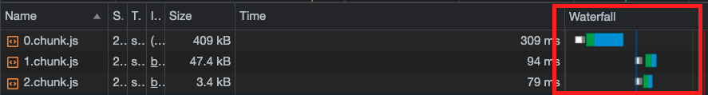

```
해당 글은 "프론트엔드 최적화 가이드"라는 도서를 기반하여 작성한 글입니다.
```

저는 해당 도서에서 제공해주는 샘플코드를 이용하고 있으므로 샘플코드가 없으신분들은 최적화하는 과정에 대해서만 알고계서도 좋을것같습니다.

<br/>

### 지연 로딩의 단점

일단 먼저 이전에 컴포넌트 지연 로딩 기법을 적용해 보았습니다. 이 기법을 적용하면 최초 페이지를 로드할 때 당장 필요 없는 코드가 포함되지 않아, 로드할 파일의 크기가 작아지고 초기 로딩 속도나 자바스크립트의 실행 타이밍이 빨라져서 화면이 더 빨리 표시된다는 장점이 있습니다. 

하지만 해당 지연 로딩 기법은 초기 화면 로딩 시에는 효과적일지 몰라도 지연 로딩이 된 코드를 실행되는 시점에는 한계가 있습니다. 코드를 분리했기 때문에 해당 코드가 실행되는 시점에 새로 로드해야 하며 로드가 완료되어야 해당 코드를 실행 할 수 있기 때문입니다. 즉, 진연 로딩이 된 코드(즉, 분리된 코드)가 실행되기까지 약간의 지연이 발생 할 수 있다는 것입니다.

이러한 문제는 사전 로딩(Preloading) 기법을 이용하면 됩니다. 사전 로딩 기법은 나중에 필요한 모듈을 필요해지기 전에 미리 로드하는 기법입니다. 예를 들면 모달을 화면에 노출되어야 하는데 모달 코드가 필요한 시점은 사용자가 버튼을 클릭하는 시점입니다. 만약에 사용자가 버튼을 클릭하기 전에 미리 모달 코드를 로드해두면 네트워크를 통해 코드를 불러오는 시간과 준비하는 데 드는 시간을 단축할 수 있어 빠르게 모달을 노출 시킬수 있습니다.

그러나 해당 방법에는 문제가 있습니다. 사용자가 버튼을 언제 클릭할지 모르니 모달 코드를 언제 미리 로드해 둘지 기준을 정하기 애매하다는 것입니다. 여기서 고려할 수 있는 타이밍이 두가지 있습니다. 하나는 사용자가 버튼 위에 마우스를 올려놨을 때(mouseenter)이고, 다른 하나는 최초에 페이지가 로드되고 모든 컴포넌트의 마운트가 끝났을 때입니다.

<br/>

### 컴포넌트 사전 로딩 타이밍

*샘플 코드를 통해 한번 적용해보겠습니다.*

#### 버튼 위에 마우스를 올려놓았을때 사전 로딩

버튼을 클릭하기 위해서는 선행적으로 마우스를 버튼 위에 올려 두어야 합니다. 그래서 잘 생각해보면 마우스가 버튼에 올라오면 사용자가 버튼을 클릭해서 모달을 띄울 것이라고 예측할 수 있습니다. 더 자세히 말하자면 아직 버튼을 클릭하지 않았지만 곧 클릭할 것이기에 모달 컴포넌트를 미리 로드해 두는 겁니다.

```jsx
function App() {
    const [showModal, setShowModal] = useState(false);

    const handleMouseEnter = () => {
        const component = import('./components/ImageModal');
    };

    return (
        <div className="App">
            ...
            <ButtonModal 
                onClick={() => { setShowModal(true) }}
                onMouseEnter={handleMouseEnter}
            >
                올림픽 사진 보기    
            </ButtonModal>
        		...
        </div>
    );
}

const ButtonModal = styled.button`
    border-radius: 30px;
    border: 1px solid #999;
    padding: 12px 30px;
    background: none;
    font-size: 1.1em;
    color: #555;
    outline: none;
    cursor: pointer;
`
```

여기서 문제점은 `handleMouseEnter` 핸들러 함수 안에 있는 사전 로딩되어 있는 컴포넌트를 어떻게 밖에서 사용할 수 있을까요? 

```jsx
function lazyWithPreload(factory) {
    const Component = React.lazy(factory);
    Component.preload = factory;

    return Component;
}

const LazyImageModal = lazyWithPreload(() => import('./components/ImageModal'));

function App() {
    const [showModal, setShowModal] = useState(false);

    const handleMouseEnter = () => {
        LazyImageModal.preload();
    };

    return (
        <div className="App">
            ...
            <ButtonModal 
                onClick={() => { setShowModal(true) }}
                onMouseEnter={handleMouseEnter}
            >
                올림픽 사진 보기    
            </ButtonModal>
        		 <Suspense fallback={null}>
                {showModal 
                 	? <LazyImageModal closeModal={() => { setShowModal(false) }} /> 
                 	: null}
            </Suspense>
        </div>
    );
}
```

위 코드처럼 팩토리 패턴을 이용하여 `lazyWithPreload` 함수를 만들어 활용할 수 있습니다.

#### 컴포넌트의 마운트 완료 후 사전 로딩

만약에 모달 컴포넌트가 크기가 커서 로드하는 데 1초 또는 그 이상의 시간이 필요할 수도 있습니다. 이런 경우에는 마우스 커서를 버튼에 올렸을 때보다 더 먼저 파일을 로드 해야합니다. 이때 생각해 볼 수 있는 타이밍은 모든 컴포넌트의 마운트가 완료된 후로, 브라우저에 여유가 생겼을 때 모달을 추가로 로드하는 겁니다.

```jsx
function lazyWithPreload(factory) {
    const Component = React.lazy(factory);
    Component.preload = factory;

    return Component;
}

const LazyImageModal = lazyWithPreload(() => import('./components/ImageModal'));

function App() {
    const [showModal, setShowModal] = useState(false);

    useEffect(() => {
      LazyImageModal.preload();
    }, []);

    return (
        <div className="App">
            ...
            <ButtonModal 
                onClick={() => { setShowModal(true) }}
            >
                올림픽 사진 보기    
            </ButtonModal>
        		 <Suspense fallback={null}>
                {showModal 
                 	? <LazyImageModal closeModal={() => { setShowModal(false) }} /> 
                 	: null}
            </Suspense>
        </div>
    );
}
```

<br/>



위 사진과 같이 네트워크 기록되어 있는것을 확인해보겠습니다. 오른쪽 Waterfall 부분을 보면 초기 페이지에 필요한 파일인 `0.chunk.js`는 우선 다운로드하고 페이지가 로드가 완료된 후에야 모달 코드인 `1.chunk.js, 2.chunk.js`를 다운로드하고 있습니다.

이렇게 두가지 방법으로 사전 로딩 기법을 적용해 봤습니다. 중요한 부분은 어느 타이밍에 사전 로드하는 것이 해당 서비스에서 가장 합리적인지 판단하는 일입니다.

<br/>
