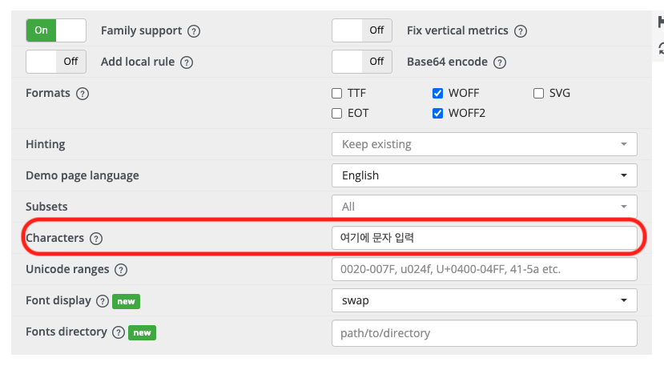
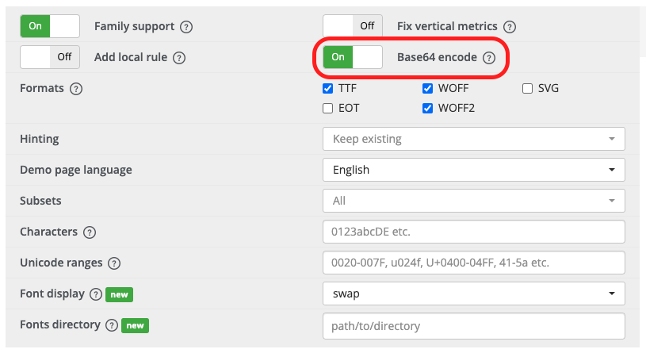
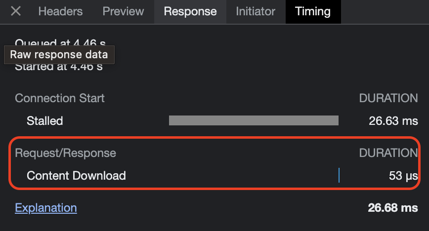

```
해당 글은 "프론트엔드 최적화 가이드"라는 도서를 기반하여 작성한 글입니다.
```

저는 해당 도서에서 제공해주는 샘플코드를 이용하고 있으므로 샘플코드가 없으신분들은 최적화하는 과정에 대해서만 알고계서도 좋을것같습니다.

<br/>

### 폰트 분석하기

브라우저 개발자도구에서 Network 패널에서 throttle 설정을 'Fast 3G'로 설정 후 폰트가 적용된 부분을 확인하면 아래와 같습니다.

- 폰트 적용 전


- 폰트 적용 후


이러한 현상은 텍스트가 보이는 시점에 폰트 다운로드가 완료되지 않아 생기는 현상입니다. Network 패널에서 폰트를 확인해 보면 파일 크기가 750kB이고 다운로드하는데 21초가 걸린 것을 볼 수 있습니다.


즉, 페이지가 로드되고 21초 후에야 폰트가 제대로 적용된 모습을 볼 수 있다는 의미입니다. 이러한 현상은 당연히 사용성에 영향을 줍니다. 폰트가 바뀌면서 깜박이는 모습은 페이지가 느리다는 느낌을 줄 수 있습니다.

<br/>

### FOUT, FOIT

폰트의 변화로 발생하는 이 현상을 FOUT(Flash of Unstyled Text) 또는 FOIT(Flash of Invisible Text)라고 합니다.

#### FOUT

FOUT는 Edge 브라우저에서 폰트를 로드하는 방식으로, 폰트의 다운로드 여부와 상관없이 먼저 텍스트를 보여준 후 폰트가 다운로드되면 그때 폰트를 적용하는 방식입니다.

#### FOIT

FOIT는 크롬, 사파리, 파이어폭스 등에서 폰트를 로드하는 방식으로, 폰트가 완전히 다운로드되기 전까지 텍스트 자체를 보여 주지 않습니다. 그리고 폰트 다운로드가 완료되면 폰트가 적용된 텍스트를 보여 줍니다. 하지만 크롬에서는 폰트가 제대로 다운로드되지 않았는데도 텍스트가 보입니다. 그 이유는 완전한 FOIT가 아니라 3초만 기다리는 FOIT이기 때문입니다. 즉, 3초 동안은 폰트가 다운로드되기를 기다리다가 3초가 지나도 폰트가 다운로드되지 않으면 기본 폰트로 텍스트를 보여줍니다. 그런 다음 폰트가 다운로드되면 해당 폰트를 적용합니다. 그래서 크롬에서 텍스트가 표시되는 과정을 보면 페이지 로드 후, 첫 3초 동안은 텍스트가 보이지 않는 것을 알 수 있습니다.

여기서 중요한 것은 폰트를 최대한 최적화해서 폰트 적용 시 발생하는 깜박임 현상을 최소화하는 것입니다.

<br/>

### 폰트 최적화 방법

폰트를 최적화하는 방법은 크게 두 가지가 있습니다. 폰트 적용 시점을 제어하는 방법 또는 폰트 사이즈를 줄이는 방법입니다.

#### 폰트 적용 시점 제어하기

예시를 한가지 들어보겠습니다. 중요한 텏스트(뉴스 제목 등)의 경우 FOIT 방식으로 폰트를 적용하면 텍스트 내용이 사용자에게 빠르게 전달되지 않을 것입니다. 반면에 사용자에게 꼭 전달하지 않아도 되는 텍스트의 경우 FOUT 방식으로 인한 폰트 변화는 사용자의 시선을 분산시킬 수 있습니다. 따라서 서비스 또는 콘텐츠의 특성에 맞게 적절한 방식을 적용해야 합니다.

CSS의 font-display 속성을 이용하면 폰트가 적용되는 시점을 제어할 수 있습니다. font-display는 @font-face에서 설정할 수 있고 다음 값을 가집니다.

- auto: 브라우저의 기본 동작 (기본 값)
- block: FOIT (timeout = 3s)
- swap: FOUT
- fallback: FOIT (timeout = 0.1s) / 3초 후에도 불러오지 못한 경우 기본 폰트로 유지, 이후 캐시
- optional: FOIT (timeout = 0.1s) / 이후 네트워크 상태에 따라 기본 폰트로 유지할지 결정, 이후 캐시

이러한 속성을 이용하면 FOUT 방식으로 폰트를 렌더링하는 Edge에 FOIT 방식을 적용하거나, FOIT 방식으로 폰트를 렌더링하는 크롬에 FOUT 방식을 적용할 수 있습니다.

fallback과 optional은 FOIT 방식이지만 텍스트를 보여 주지 않는 시간이 3초가 아닌 0.1초입니다. 차이점은 fallback의 경우 3초 후에도 폰트를 다운로드하지 못한 경우, 이후에 폰트가 다운로드되더라도 폰트를 적용하지 않고 캐시해 둡니다. 결국 최초 페이지 로드엣 폰트가 늦게 다운로드되면 폰트가 적용되지 않는 모습이 계속 보입니다. 하지만 페이지를 다시 로드했을때는 폰트가 캐시되어 있으므로 바로 폰트가 적용된 텍스트를 볼 수 있게 됩니다. optional의 경우 3초가 아니라 사용자의 네트워크 상태를 기준으로 폰트를 적용할지 기본 폰트로 유지할지 결정합니다.

```css
@font-face {
  font-family: 폰트이름;
  src: url('폰트경로');
  font-display: block;
}
```

다시 한번 정리하면, `font-display` 속성을 이용해서 폰트가 적용되는 시점을 제어할 수 있습니다. 중요한 것은 서비스하는 콘텐츠의 특성에 맞게 적절한 값을 설정하는 것입니다.

이번글에서는 FOIT 방식인 block을 사용할 것입니다. 그 이유는 적용할 텍스트는 빠르게 보여 줘야 하거나 중요한 내용의 텍스트는 아니기 때문에 폰트가 적용된 상태로 보이는 것이 사용자에게 더 자연스러워 보이기 때문입니다. 여기서 문제는 block 옵션을 설정하면 안보이던 폰트가 갑자기 나타나서 조금 어색할 수도 있다는 점입니다. 이러한 문제를 해결하기 위해 페이드 인 애니메니션을 적용해 보려고 합니다.

폰트에 페이드 인 효과를 적용하려면 CSS가 아닌 자바스크립트의 도움이 필요합니다. 폰트가 다운로드되기 전에는 텍스트를 보여 주지 않다가 다운로드가 완료되면 페이드 인 효과와 함께 폰트가 적용된 텍스트를 보여 주는 것입니다. 그러려면 먼저 폰트가 다운로드 완료되는 시점을 알아야 합니다. 폰트의 다운로드 시점은 fontfaceobserver라는 라이브러리를 통해 알 수 있습니다.

> https://fontfaceobserver.com/

간단히 샘플코드를 통해 fontfaceobserver를 사용해보겠습니다.

```javascript
const font = new FontFaceObserver('BMYEONSUNG');

function Sample() {
  const [isFontLoaded, setIsFontLoaded] = useState(false);

  useEffect(() => {
    font.load(null, 20000).then(() => {
      setIsFontLoaded(true);
    });
  }, []);

  return (
    <div
      style={{
        opacity: isFontLoaded ? 1 : 0,
        transition: 'opacity 0.3s ease',
      }}
    >
      Test
    </div>
  );
}
```

위 코드와 같이 load 메서드를 통해 어느 시점에 폰트가 다운로드 되었는지를 알 수 있습니다. opacity를 폰트 로드 상태에 따라 0에서 1로 바꿔 주고 transition 속성을 설정하면 폰트가 로드될 때 텍스트가 애니메이션 효과와 함께 나타날 것입니다.

텍스트를 단순히 빠르게 띄우는 것도 좋지만, 이런 식으로 사용자에게 보기 편하게 서비스하는 것도 체감 성능을 높이는 데 중요합니다.

#### 폰트 파일 크기 줄이기

이번에는 폰트 파일 크기를 줄여 폰트가 다운로드되는 시간을 단축하는 방법을 알아보겠습니다. 폰트 파일 크기를 줄이는 방법에는 두 가지가 있습니다. 하나는 이미지나 비디오와 마찬가지로 압축률이 좋은 폰트 포맷을 사용하는 것이고, 다른 하나는 필요한 문자의 폰트만 로드하는 것입니다.

##### 폰트 포맷 변경하기

우리가 흔히 알고 있는 폰트 포맷은 TTF 및 OTF 포맷입니다. 이번글에서 사용하는 포맷은 TTF 포맷입니다. 하지만 TTF 포맷은 파일 크기가 매우 큽니다. 웹 환경에서는 해당 리소스(폰트)를 매번 다운로드 해야 하므로 적절하지 않습니다. 그래서 나온 것이 WOFF입니다.

WOFF는 Web Open Font Fomat의 약자로, 이름 그대로 웹을 위한 폰트입니다. 이 포맷은 TTF 폰트를 압축하여 웹에서 더욱 빠르게 로드할 수 있도록 만들었습니다. 더 나아갓서 WOFF2라는 더욱 향상된 압축 방식을 적용한 포맷도 있습니다.

```
파일 크기 : EOT > TTF/OTF > WOFF > WOFF2
```

하지만 WOFF와 WOFF2에도 브라우저 호환성 문제가 있습니다. 물론 모던 브라우저에서는 정상적으로 사용할 수 있지만, 버전이 낮은 일부 브라우저에서는 해당 포맷을 지원하지 않을 수 있습니다. 그래서 WOFF2를 우선으로 적용하고 만약 브라우저가 WOFF2를 지원하지 않으면 WOFF를, WOFF도 지원하지 않으면 TTF를 적용해보도록 하겠습니다.

앞서서 말한것처럼 현재 사용하고 있는 포맷은 TTF로 가정하고 이 포맷 폰트를 Transfonter 라는 서비스를 이용하여 WOFF와 WOFF2로 변환을 해보겠습니다.

> https://transfonter.org/

해당 서비스를 이용하여 폰트를 변환하는 방법은 생략하겠습니다. 위에 해당 서비스 링크를 추가해두었으니 참고 부탁드립니다.

TTF 포맷을 WOFF와 WOFF2로 변환을 하게 된다면 1.9MB(TTF)에서 790KB(WOFF)와 447KB(WOFF2)로 폰트 파일의 크기가 줄어듭니다.

폰트를 적용하기 위해서는 `@font-face` 에 넣으면 되며, src 속성에 적용 우선순위가 높은 것부터 차례로 나열하면 됩니다.

```css
@font-face {
  font-family: 폰트 이름;
  src: url('폰트.woff2') format('woff2'), url('폰트.woff') format('woff'),
    url('폰트.ttf') format('truetype');
  font-display: block;
}
```

해당 폰트가 적용된 페이지를 브라우저에서 Network패널에서 확인해보면 WOFF2 포맷의 폰트가 로드되는 것을 볼 수 있습니다. 만약 브라우저가 WOFF2를 지원하지 않는다면 WOFF를 로드할 것입니다.

##### 서브센 폰트 사용

앞서서는 폰트 포맷을 변경하여 파일 크기를 줄여 봤습니다. 꽤 의미 있는 수준으로 줄어들긴 했지만 447KB(WOFF2)이라는 용량은 여전히 너무 큽니다. 하지만 폰트라는 것은 모든 글자에 대한 스타일 정보를 모두 담고 있기 때문에 이 이상 줄이기 어려울지도 모릅니다. 그런데 만약 웹 서비스에서 웹 폰트를 사용하는 텍스트가 하나이거나 특정 부분일 경우에는 모든 문장의 폰트 정보를 가지고 있을 필요 없이 해당 문자의 폰트 정보만 있으면 된다는 의미입니다.

이렇게 모든 문자가 아닌 일부 문자의 폰트 정보만 가지고 있는 것을 서브셋 폰트라고 합니다.

서브셋 폰트는 이전에 폰트 포맷을 변경할때 사용하였던 Transfonter 서비스에서 생성할 수 있습니다.



위에 첨부된 사진을 보면 빨간색 박스로 하이라이트된 Charactors 속성에서 필요한 문자를 입력하면 해당 문자관련 서브셋 폰트 파일이 생성됩니다.

그래서 변환된 파일을 확인해보면 파일 크기가 매우 작음을 확인할 수 있습니다. 왜냐하면 기존에 폰트 파일에는 모든 문자의 폰트 정보가 포함되어 있었기 때문에 파일 크기가 굉장히 컷는데, 서브셋 폰트에서는 일부 문자를 제외하고 모두 제거했기 때문입니다.

해당 폰트도 이전 했던 방식처럼 `@font-face` 에 넣으면 됩니다.

```css
@font-face {
  font-family: 폰트 이름;
  src: url('서브셋 폰트.woff2') format('woff2'), url('서브셋 폰트.woff') format('woff'),
    url('서브셋 폰트.ttf') format('truetype');
  font-display: block;
}
```

서브셋 폰트를 적용한 후 Network 패널에서 확인해보면, 서브셋 폰트가 아닌것보다 파일 크기가 줄었고, 빠르게 로드되는 것을 볼 수 있습니다.

여기서 또 다른 방법이 있습니다. 폰트를 파일 형태가 아닌 Data-URI 형태로 CSS 파일에 포함할 수 있습니다.

Data-URI랄 data 스킴이 접두어로 붙은 문자열 형태의 데이터인데, 쉽게 말해서 파일을 문자열 형태로 변환하여 문서(HTML, CSS, 자바스크립트 등)에 인라인으로 삽입하는 것입니다. 보통은 css 파일이 로드된 후 폰트를 적용하기 위해 폰트 파일을 추가로 로드해야 하지만, Data-URI 형태로 만들어서 css 파일에 넣어 두면 별도의 네트워크 로드 없이 css 파일에서 폰트를 사용할 수 있습니다.

폰트 파일을 Data-URI 형태로 css 에 포함하려면 먼저 폰트를 문자열 데이터로 변환해야 합니다. 이때도 Transfonter을 이용하면 됩니다. 해당 폰트를 Data-URI 형태로 추출하기 위해서 Base64 encode 옵션을 On으로 설정해 줍니다.



변환이 완료되면 변환된 파일 중 stylesheet.css 파일을 열어 `@font-face`에서 `src`속성에 url 부분을 복사해서 가져와 적용할 css 파일에 넣어주면됩니다.

```css
@font-face {
  font-family: 폰트 이름;
  src: url('data:font/woff2;charset=utf-8;base64....') format('woff2'), url('서브셋 폰트.woff')
      format('woff'), url('서브셋 폰트.ttf') format('truetype');
  font-display: block;
}
```

그리고나서 해당 페이지를 브라우저 Network 패널에서 확인해보면 폰트가 Data-URI 형태로 로드되는 것을 볼 수 있습니다. 그리고 소요시간을 보면 매우 짧은것을 확인해 볼 수 있습니다.

기본적으로 브라우저에서 Data-URI를 네트워크 트래픽으로 인식해서 기록하지만 실제로는 이미 다른 파일 내부에 임베드되어 있어 별도의 다운로드 시간이 필요하지 않습니다. 그래서 시간이 매우 짧은 것입니다. 해당 Data-URI 항목을 클릭하여 Timing 탭을 살펴보면 다운로드 시간이 고려하지 않아도 될 만큼 작음을 알 수 있습니다.



여기서 주의할점은 Data-URI 형태가 항상 좋은 것은 아니라는 점입니다. 해당 폰트 내용은 css 파일에 포함된 것이므로 css의 다운로드 속도 또한 고려해야 합니다. Data-URI가 포함된 만큼 css 파일의 다운로드는 느려질 것입니다. 이번 글에서는 해당 폰트 파일을 서브셋을 통해 파일 크기를 매우 작게 만들었기 때문에 Data-URI 형태로 포함해도 큰 문제가 없지만, 매우 큰 파일을 Data-URI 형태로 포함한다면 포함한 파일 크기가 그만큼 커져 또 다른 병목을 발생시킬 수 있습니다.

<br/>
