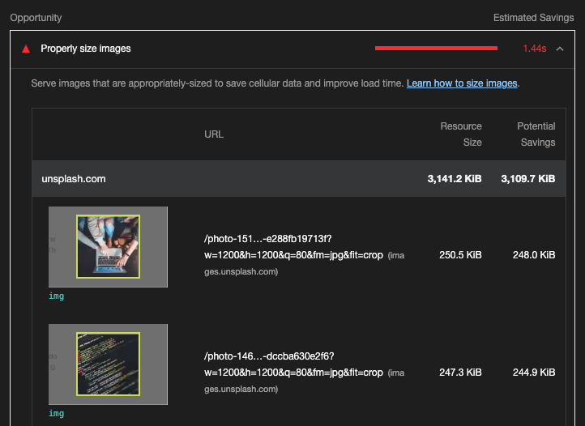
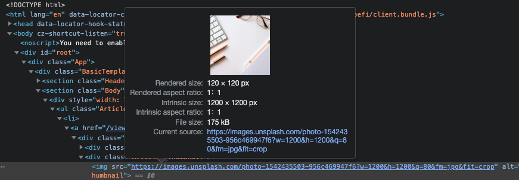
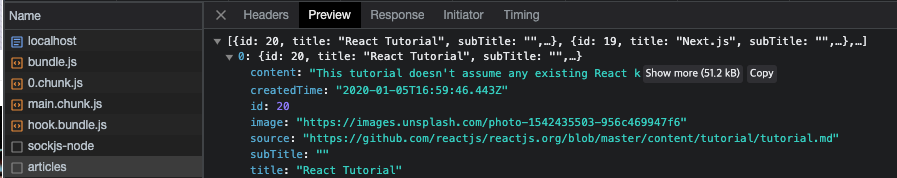

```
해당 글은 "프론트엔드 최적화 가이드"라는 도서를 기반하여 작성한 글입니다.
```

 <br/>

### 비효율적인 이미지 분석

해당 분석하고자 하는 웹사이트를 Lighthouse 를 통해 분석합니다. 그리고 분석 결과에서 Opportunities 섹션의 'Properly size images' 항목을 주목합니다. 이 항목은 이미지를 적절한 사이즈를 사용하도록 제안합니다.

해당 항목을 펼쳐서 내용을 살펴보면 어떤 이미지가 적절한지 않은 사이즈인지 리스트로 보여줍니다. 



해당 웹 사이트에 포함된 이미지가 얼마나 크기에 로딩 시간을 단축시킬 수 있는 것인지 이미지를 직전 확인해 보겠습니다.

이미지를 확인하려면 크롬 개발자 도구 중 Elements 패널로 이동해야 합니다. 그리고 아래 사진처럼 이미지 요소를 선택합니다.



위 사진에서 내용을 확인하면 실제 이미지 사이지(Intrinsic size)는 1200 x 1200px 인데, 화면에 그려지는 이미지의 사이즈(Rendered size)는 120 x 120px이라고 합니다. 그래서 큰 사이즈의 이미지를 사용해도 1200 x 1200px로 표시하지 못하니, 처음부터 120 x 120px에 맞는 이미지를 사용하라는 의미입니다. 

**그렇다면 이 이미지를 어느 정도 사이즈로 만들어서 사용해야 적절할까요?**

단순히 120 x 120px로 만들어야 된다고 생각할 수 있지만, 요즘 사용되는 레티나 디스플레이는 같은 공간(픽셀)에 더 많은 픽셀을 그릴 수 있기 때문에, 두 배 정도 큰 이미지를 사용하는것이 적절합니다. 즉, 240 x 240px 사이즈로 사용하는 것입니다.

**이미지 사이즈를 어떻게 줄이는가?**

해당 방법을 알기 위해서는 해당 이미지가 어디서 오는지 파악해야 합니다. 크롬 Network 패널에서 확인 할 수 있습니다. 현재 해당 이미지는 서버에서 전달해주고 있고 해당 전달된 데이터를 확인해보니 이미지 주소로 전달하고 있는걸로 확인이 됩니다.

 

이미지 정보가 어디서 오는지 확인해 봤는데, 한가지 문제가 생겼습니다. 자체적을 가지고 있는 정적 이미지라면 사진 편집 툴을 이용하여 직접 이미지 사이즈를 조절하면 되는데, 현재는 API를 통해 받아오고 있습니다.

**이미지를 API를 통해 받아오는 경우 어떻게 이미지 사이즈를 조절할까요?**

한 가지 방법은 Cloudinary나 Imgix 같은 이미지 CDN을 사용하는 방법입니다.

<br/>

### 이미지 CDN

CDN(Content Delivery Network)이란 물리적인 거리의 한계를 극복하기 위해 사용자와 가까운 곳에 콘텐츠 서버를 두는 기술을 의미합니다. 

예를 들어 한국에 있는 사용자가 미구에 있는 서버에서 이미지를 다운로드 하는 경우, 아무리 요즘 인터넷이 빨라졌다고 해도 서버와 사용자 사이에는 굉장히 큰 물리적 거리가 있기 때문에 다운로드에 시간이 오래 걸릴 것입니다. 이 문제를 해결하기 위해 다음과 같이 생각해 볼 수 있습니다.

미국에 있는 서버를 미리 한국으로 복사해 두고, 사용자가 이미지를 다운로드하려고 할 때 미국 서버가 아닌 한국 서버에서 다운로드하도록 하는 것입니다. 그러면 물리적 거리가 어느정도 해소가 됐으니 다운로드에 걸리는 시간도 단축이 됩니다. 

이미지 CDN은 이미지에 특화된 CDN이라고 볼 수 있습니다. 기본적인 CDN 기능과 더불어 이미지를 사용자에게 보내기 전에 특정 형태로 가공하여 전해주는 기능까지 있습니다. 예를 들어 이미지 사이즈를 줄이거나, 특정 포맷으로 변경하는 증의 작업 가능합니다.

일반적인 이미지 CDN에서 제공하는 주소는 다음과 같이 이루어져 있습니다.

```
http://cdn.image.com?src=[img src]&width=240&height=240
```

이런 이미지 CDN을 자체적으로 만들어서 사용할 수도 있지만, Imgix와 같은 이미지 CDN 솔루션을 사용할 수 있습니다.

> imgix는 더 빠른 페이지, 더 나은 시각적 품질, 더 간단한 워크플로우를 위해 이미지와 비디오를 관리, 최적화 및 제공한다고 합니다.

### <br/>
