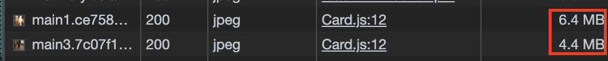
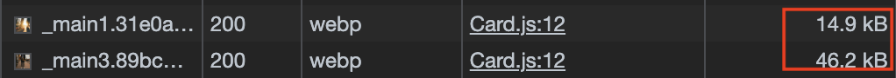

```
해당 글은 "프론트엔드 최적화 가이드"라는 도서를 기반하여 작성한 글입니다.
```

저는 해당 도서에서 제공해주는 샘플코드를 이용하고 있으므로 샘플코드가 없으신분들은 최적화하는 과정에 대해서만 알고계서도 좋을것같습니다.

<br/>

### 느린 이미지 로딩 분석

개발자 도구에서 Network 패널을 통해 분석할 이미지를 살펴보면, 파일 크기가 매우 큰 것을 볼 수 있습니다. 이미지 사이즈가 크면 다운로드에 많은 시간이 걸리고 그만큼 다른 작업에 영향을 줍니다.



<br/>

### 이미지 포맷 종류

이미지 사이즈 최적화는 간략히 말하면 이미지의 가로, 세로 사이지를 줄여 이미지 용량을 줄이고 그만큼 더 빠르게 다운로드하는 기법입니다.

이미지의 사이즈를 줄이기 전에, 이미지를 잘 다루기 위해 짚고 넘어가야 할 것이 있습니다. 이미지 포맷이라는 것입니다. 이미지 포맷중에서 SVG와 같은 백터 이미지가 아닌 비트맵 이미지 포맷 중 대표적인 세가지 포맷을 살펴보겠습니다.

> 백터 이미지와 비트맵 이미지란?!
>
> https://imweb.me/faq?mode=view&category=29&category2=33&idx=71515

- PNG
- JPG
- WebP

#### PNG

무손실 압축 방식으로 원본을 훼손 없이 압축하며 알파 채널을 지원하는 이미지 포맷입니다. 알파 채널은 투명도를 의미합니다. PNG 포맷으로 배경 색을 투명하게 하여 뒤에 있는 요소가 보이는 이미지를 만들 수 있습니다.

#### JPG(JPEG)

PNG와 다르게 압축 과정에서 정보 손실이 발생합니다. 하지만 그만큼 이미지를 더 작은 사이즈로 줄일 수 있습니다. 그래서 일반적으로 웹에서 이미지를 사용할 때는 고화질이어야 하거나 투명도 정보가 필요한게 아니라면 JPG를 사용합니다.

#### WebP

무손실 압축과 손실 압축을 모두 제공하는 최신 이미지 포맷으로, 기존의 PNG와 JPG에 비해서 대단히 효율적으로 이미지를 압축할 수 있습니다. WebP 방식은 PNG 대비 26%, JPG 대비 25 ~ 34% 더 나은 효율을 가지고 있다고 합니다.

> WebP 관련하여 공식 문서
>
> https://developers.google.com/speed/webp?hl=ko

앞서 설명으로만 봤을때는 PNG보다는 JPG, JPG보다는 WebP를 사용하는 것이 좋을 것 같지만, 마냥 간단한 문제는 아닙니다. 그 이유는 브라우저 호환성 때문입니다. WebP는 위에서 언급했듯 꽤나 최신 이미지 파일 포맷이라서 아직 지원하지 않는 브라우저도 있습니다.

> WebP 브라우저 호환성: https://caniuse.com/?search=webp

- 사이즈: PNG > JPG > WebP
- 화질: PNG = WebP > JPG
- 호환성: PNG = JPG > WebP

<br />

### Squoosh를 사용하여 이미지 변환

JPG or PNG 포맷의 이미지를 WebP 포맷으로 변환하여 고화질, 저용량의 이미지로 최적화해 보려고 합니다. 그러려면 이미지를 변환해 주는 컨버터가 필요한데, 여기서 사용할 컨버터는 Squoosh 라는 애플리케이션입니다.

> https://squoosh.app/

Squoosh는 구글에서 만든 이미지 컨버터 웹 애플리케이션입니다. 별도의 프로그램 설치 없이 웹에서 이미지를 쉽게 여러 가지 포맷으로 변환할 수 있습니다. 그리고 원본과 비교하는 등 다양한 기능을 이용할 수 있습니다.

이번 글에서는 Squoosh를 사용하는 방법에 대하여 다루지 않겠습니다. 사용법은 아래 동영상 링크를 참고 부탁드립니다.

> https://www.youtube.com/watch?v=8QYVWrBDz2Y

각 이미지들을 WebP 포맷으로 변경후 다시 Network 패널을 보면 이미지의 사이즈가 줄어들었고, 해당 이미지 크기가 줄어들었기 때문에 다운로드 시간도 짧아집니다.



예를 들어 아래 코드처럼 브라우저 사이즈에 따라 지정된 이미지를 렌더링하거나 지원되는 타입의 이미지를 찾아 렌더링합니다.

```html
// 뷰포트에 따라 구문
<picture>
  <source media="(min-width:650px)" srcset="img1.jpg" />
  <source media="(min-width:465px)" srcset="img2.jpg" />
  
</picture>

// 이미지 포맷에 따라 구분
<picture>
  <source srcset="img1.avif" type="image/avif" />
  <source srcset="img2.webp" type="image/webp" />
  
</picture>
```

<br/>
