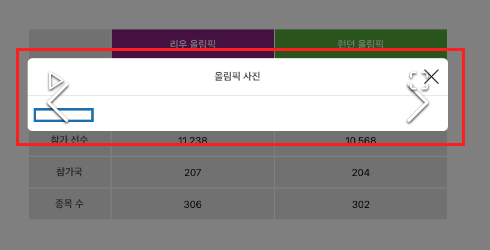
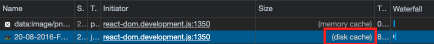

```
해당 글은 "프론트엔드 최적화 가이드"라는 도서를 기반하여 작성한 글입니다.
```

저는 해당 도서에서 제공해주는 샘플코드를 이용하고 있으므로 샘플코드가 없으신분들은 최적화하는 과정에 대해서만 알고계서도 좋을것같습니다.

<br/>

### 느린 이미지 로딩

이미지의 사이즈가 클때 다운로드 시간이 오래 걸려서 다운로드가 완료될 때까지 아무것도 뜨지 않는 현상이 발생합니다. 여기서 이미지가 화면에 제때 뜰 수 있도록 미리 다운로드하는 기법인 이미지 사전 로딩 기법을 적용해 보겠습니다.



<br/>

### 이미지 사전 로딩

이미지는 이미지가 화면에 그려지는 시점, 즉 HTML 또는 CSS에서 이미지를 사용하는 시점에 로드됩니다. 하지만 이런 경우 외에 자바스크립트로 이미지를 직접 로드하는 방법이 한가지 있습니다. 자바스크립트의 `Image` 객체를 사용하는 방법입니다.

`Image` 객체는 아래와 같이 사용할 수 있습니다.

```javascript
const img = new Image();
img.src = `{이미지 주소}`
```

해당 방법을 이용하여 샘플 코드에 적용해 보겠습니다.

해당 코드는 첫 페이지 마운트된 후인 타이밍에 이미지를 사전 로드하는 코드입니다.

```jsx
useEffect(() => {
        LazyImageModal.preload();

        const img = new Image();
        img.src = 'https://stillmed.olympic.org/media/Photos/2016/08/20/part-1/20-08-2016-Football-Men-01.jpg?interpolation=lanczos-none&resize=*:800';
}, []);
```

위와 같은 코드가 이미지 사전 로딩이 가능한 이유는 이미지를 로드할 때 브라우저가 해당 이미지를 캐싱해 두기 때문입니다.



위에 사진을 보면 네크워크 패널에서 확인한 결과입니다. 조금 더 살펴보면 사전 로드한 이미지의 Size 항목이 disk cache라고 적혀 있습니다. 그리고 다운로드 시간이 매우 짧은 것을 볼 수 있습니다. 그 이유는 페이지가 로드된 후 바로 이미지를 사전 로드해 뒀기 때문입니다. 

그런데 여기서 한가지 고민해볼것은 몇 장의 이미지까지 사전 로드해 둘 것인가입니다. 사전 로딩을 하는 순간 브라우저의 리소스를 그만큼 많이 사용하기 떄문에 다른 성능 문제를 야기할수도 있습니다. 따라서 어떤 콘텐츠를 사전 로드할 때는 정말 사전 로딩이 필요한지 고민해야 합니다. 

<br/>
