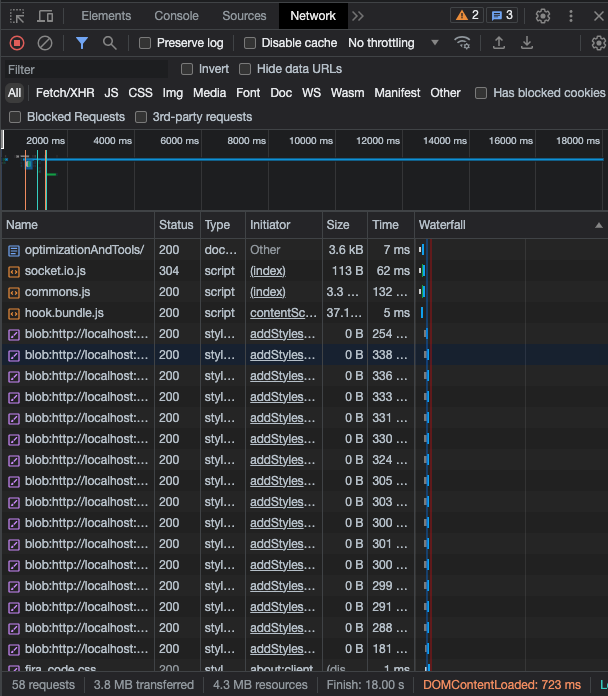
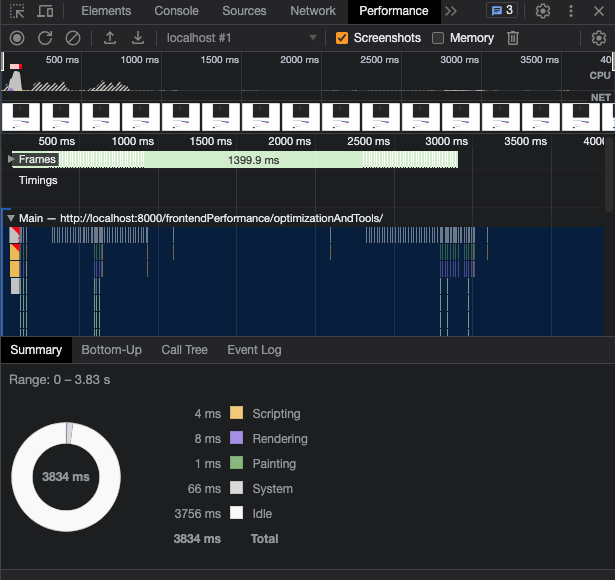
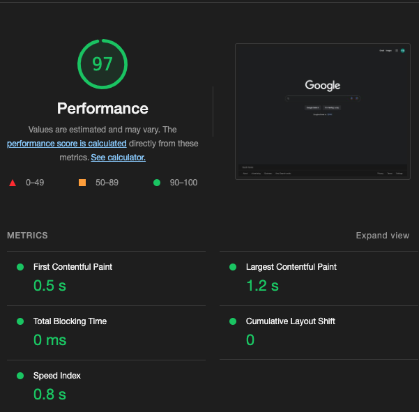
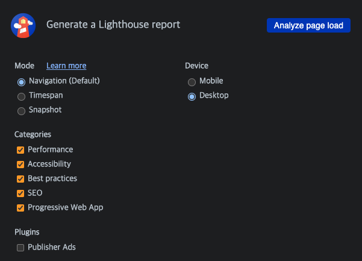
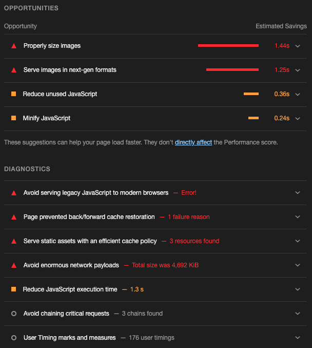

```
해당 글은 "프론트엔드 최적화 가이드"라는 도서를 기반하여 작성한 글입니다.
```

## 최적화 기법 종류

최적화 기법에는 이미지 사이즈 최적화, 코드 분할, 텍스트 압축, 병목 코드 최적화가 있습니다. 각 최적화 기법에 대하여 설명드리겠습니다. 

### 이미지 사이즈 최적화

웹 서비스에서는 매우 다양한 이미지를 사용합니다. 하지만 너무 큰 사이즈의 이미지를 무분별하게 사용하면 네트워크 트래픽이 증가해 서비스 로딩이 오래 걸립니다. 그렇다고 이미지 사이즈를 무작정 작게 만들면 이미지 화질이 저하되어 서비스 이용이 불편해집니다. 따라서 어떤 이미지 사이즈가 적절한지 살펴봐야 합니다. 

### 코드 분할

말 그대로 코드를 분할하는 기법입니다. 예를들면 리액트는 SPA(Single Page Application) 기반한 라이브러리입니다. SPA의 특성상 모든 리액트 코드가 하나의 자바스크립트 파일로 번들링되어 로드되기 때문에, 첫 페이지 진입 시 당장 사용하지 않는 코드가 포함이 되어 있을 수 있습니다. 이때 코드 분할을 통해 당장은 필요 없는 코드를 떼어 내고, 해당 코드를 필요한 시점에 따로 로드할 수 있습니다. 

> dynamic import 구문 사용을 하거나 리액트를 사용한다면 React.lazy 함수를 통해 dynamic import 를 사용할 수 있습니다.

### 텍스트 압축

웹 페이지에 접속하면 HTML, CSS, 자바스크립트 등등 다양한 리소스를 내려받습니다. 이런 리소스는 다운로드 전에 미리 압축할 수 있습니다. 그러면 원래 사이즈보다 더 작은 사이즈로 다운로드할 수 있어 웹 페이지가 더 빠르게 로드됩니다.

> 예를들어, 자바스크립트에 있는 불필요한 공백을 지우고, 변수와 함수의 이름들을 a, b, 등등 변경하는 작업이 있습니다. 즉, 난독화 작업이라고도 할 수 있습니다. 
> webpack 사용한다면 terser 플러그인을 활용할 수 있습니다.

### 병목 코드 최적화

자바스크립트 코드 때문에 서비스가 너무 느리게 다운로드되거나 느리게 실행되는 경우가 있습니다. 이처럼 서비스를 느리게 만드는 코드를 병목 코드라고 합니다.

> 리액트에서는 React.memo, useMemo(), useCallback() 활용할 수도 있을것 같습니다.

<br/>

이러한 최적화 기법을 사용하기전에 웹 서비스에 어떠한 부분을 최적화해야 하는지 분석 하기 위한 분석관련 툴에 대하여 설명 드리겠습니다.

### 크롬 개발자 도구의 Network 패널



네트워크 패널은 현재 웹 페이지에서 발생하는 모든 네트워크 트래픽을 상세하게 알려 줍니다. 이를 통해 어떤 리소스가 어느 시점에 로드되는지, 해당 리소스의 크기 등을 확인할 수 있습니다.

### 크롬 개발자 도구의 Performance 패널



Performance 패널은 웹 페이지가 로드될 때, 실행되는 모든 작업을 보여줍니다. 브라우저의 메인 스레드에서 실행되는 자바스크립트를 차트 형태로 볼 수 있습니다. 따라서 이 패널을 통해 어떤 자바스크립트 코드가 느린지 확인할 수 있습니다.

### 크롬 개발자 도구의 Lighthouse 패널



Lighthouse는 구글에서 만든 툴로, 웹사이트의 성능을 측정하고 개선 방향을 제시해 주는 자동화 툴입니다. Lighthouse를 이용하여 웹사이트의 성능 점수를 측정하고 개선 가이드를 확인함으로써 어떤 부분을 중점적으로 분석하고 최적화해야 하는지 알 수 있습니다.

### webpack-bundle-analyzer

webpack을 통해 번들링된 파일이 어떤 코드, 즉 어떤 라이브러리를 담고 있는지 보여줍니다. 이 툴을 사용해 최종적으로 완성된 번들 파일 중 불필요한 코드가 어떤 코드이고, 번들 파일에서 어느 정도의 비중을 차지하고 있는지 확인 할 수 있습니다.

> https://github.com/webpack-contrib/webpack-bundle-analyzer

<br/>

## Lighthouse 툴을 이용한 페이지 검사

### Lighthouse 검사하기



Mode는 기본 값인 'Navigation'으로 설정하고, Categories 항목에서 원하는 검사 주제를 선택하면 됩니다. 그리고 Device 항목은 모바일 환경으로 검사할지, 테스크톱 환경으로 검사할지 결정합니다. 만약 'Mobile'을 선택하면, Lighthouse는 모바일 사이즈의 화면에서 좀 더 느린 CPU와 네트쿼크 환경으로 검사를 진행합니다.

**Mode 항목 값**

- Navigation: Lighthouse의 기본 값으로, 초기 페이지 로딩 시 발생하는 성능 문제를 분석
- Timespan: 사용자가 정의한 시간 동안 발생한 성능 문제를 분석
- Snapshot: 현재 상태의 성능 문제를 분석

**Categories 항목 값**

- Performance: 웹 페이지의 로딩 과정에서 발생하는 성능 문제를 분석
- Accessibility: 서비스의 사용자 접근성 문제를 분석
- Best Practices: 웹사이트의 보안 측면과 웹 개발의 최신 표준에 중점을 두고 분석
- SEO: 검색 엔진에서 얼마나 잘 크롤링되고 검색 결과에 표시되는 분석
- Progressive Wep App: 서비스 워커와 오프라인 동작 등, PWA와 관련된 문제를 분석

<br/>

### Lighthouse 검사 결과


위 사진에 점수 아래에 `METRICS` 항목에 있는 지표를 웹 바이탈(Web Vitals)이라고 부릅니다. 

Lighthouse에서 검사한 웹 바이탈을 하나씩 살펴 보겠습니다.

#### First Contentful Paint(FCP)

FCP는 페이지가 로드될 때 브라우저가 DOM 콘텐츠의 첫 번째 부분을 렌더링 하는 데 걸리는 시간에 관한 지표입니다. 

#### Speed Index(SI)

SI는 페이지 로드 중에 콘텐츠가 시각적으로 표시되는 속도를 나타내는 지표입니다.

#### Largest Contentful Paint(LCP)

LCP는 페이지가 로드될 때 화면 내에 있는 가장 큰 이미지나 텍스트 요소가 렌더링되기까지 걸리는 시간을 나타내는 지표입니다.

#### Time to Interactive(TTI)

TTI는 사용자가 페이지와 상호 작용이 가능한 시점까지 걸리는 시간을 측정한 지표입니다. 여기서 상호 작용이란 클릭 또는 기보드 누름 같은 사용자 입력을 의미합니다. 즉, 이 시점 전까지는 화면이 보이더라도 클릭 같은 입력이 동작하지 않습니다.

#### Total Blocking Time(TBT)

TBT는 페이지가 클릭, 키보드 입력 등의 사용자 입력에 응답하지 않도록 차단된 시간을 종합 지표입니다.

#### Cumulative Layout Shift(CLS)

CLS는 페이지 로드 과정에서 발생하는 예기치 못한 레이아웃 이동을 측정한 지표입니다.  레이아웃 이동이란 화면상에서 요소의 위치나 크기가 순간적으로 변하는 것을 말합니다.

<br />

### Opportunities 섹션과 Diagnostics 섹션



이 두 섹션은 웹 페이지의 문제점과 해결 방안, 그리고 문제를 해결함으로써 얻을 수 있는 이점이 무엇인지 보여 줍니다. Opportunities 섹션은 페이지를 더욱 빨리 로드하는 데 잠재적으로 도움되는 제안을 나열하며, Diagnostics 섹션은 로드 속도와 직접적인 관계는 없지만 성능과 관련된 기타 정보를 보여 줍니다.

**따라서 이 두 섹션을 통해 해당 서비스의 어느 부분을 개선해야 성능을 향상할 수 있는지 쉽게 파악할 수 있습니다.**

### <br/>
