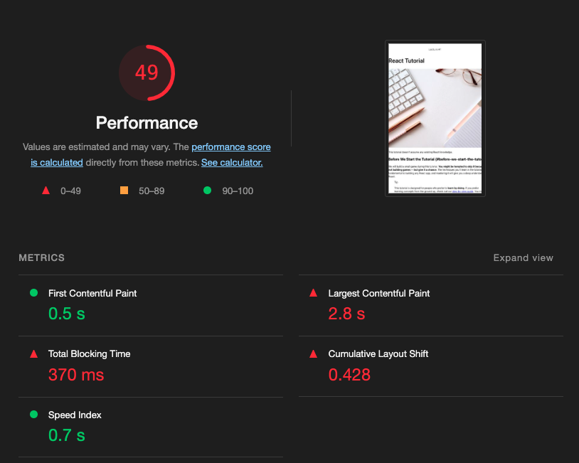

```
해당 글은 "프론트엔드 최적화 가이드"라는 도서를 기반하여 작성한 글입니다.
```

이번 글에서는 최적화 기법중 텍스트 압축이 무엇이고, 어떻게 적용할 수 있는지에 대하여 알아 보겠습니다.

저는 해당 도서에서 제공해주는 샘플코드를 이용하고 있으므로 샘플코드가 없으신분들은 최적화하는 과정에 대해서만 알고계서도 좋을것같습니다.

### production 환경과 development 환경

텍스트 압축을 설명하기전에 production 환경과 development 환경에 차이에 대하여 한번 살펴보겠습니다. create-react-app을 사용하는 경우에는 production 환경일 때는 webpack에서 경량화라든지 난독화(uglify) 같은 추가적인 최적화 작업을 합니다. 반면에 development 환경에서는 그런 최적화 작업 없이 서비스를 실행합니다. 즉, 각 환경에서 성능을 측정할 때 차이가 있으므로 최종 서비스의 성능을 측정할 때는 실제 사용자에게 제공되는 production 환경으로 빌드된 서비스의 성능을 측정해야 합니다. 

production 환경으로 측정하기 위해서는 물론 netlify 나 vercel 등등 웹 호스팅 서비스를 이용할 순 있지만 해당 방법은 조금 불편하므로 serve 라는 외부 라이브러리를 사용할 수 있습니다. 

> https://www.npmjs.com/package/serve   
> 해당 라이브러리를 통해 빌드된 파일을 실행할 수 있습니다.

<br />

production 환경과 development 환경에서 어떤 차이가 있는지 살펴 보겠습니다.

- development 환경


<br />

- production 환경


<br />

위 두개의 사진으로 비교하면 전반적인 자바스크립트 파일의 크기가 줄어든것으로 보입니다. 왜냐하면 빌드할 때(production 환경) 경량화 같은 최적화 작업이 이루어졌기 때문입니다.

<br />

Lighthouse 를 통해 어떤 페이지를 검사한 결과가 다음과 같습니다. 



Lighthouse 분석 결과가 점수가 굉장히 낮게 나왔습니다. 그럼 Opportunities 섹션을 한번 보면 Enable text compression 이라는 항목이 있습니다.


해당 항목은 *서버로부터 리소스를 받을 때, 텍스트 압축을 해서 받아라* 라는 의미입니다. 그리고 이 항목을 자세히 보면 총 616KiB -> 403KiB로 줄일수 있고 그중에서 가장 많이 차지 하고 있는 3.5af7 ee7a.chunk.js 파일을 444KiB -> 286KiB 로 줄일수 있는걸로 보입니다. 만약에 해당 청크 파일 용량을 줄인다면 0.2초 정도 단축시킬수 있다고 합니다. 

<br />

### 텍스트 압축

웹 페이지를 로드할 때는 다양한 리소스를 다운로드합니다. 대표적으로 HTML, CSS, 자바스크립트와 같은 텍스트 형태의 파일이 있습니다. 이런 리소스를 다운로드할 때 파일 크기가 클수록 로딩이 완료되는 데 오래 걸립니다. 따라서 리소스가 빠르게 다운로드될 수 있도록 코드 분할 같은 최적화 기법을 적용하여 리소스 크기를 줄일 수 있습니다. 그리고 또 텍스트 압축 기법도 리소스의 크기를 줄이는 기법중 하나 입니다. 

텍스트 압축이라는 것은 말 그대로 텍스트를 압축하는 것입니다. HTML, CSS, 자바스크립트는 텍스트 기반의 파일이기 때문에 텍스트 압축 기법을 사용할 수 있습니다. *이런 파일을 압축하여 더 작은 크기로 빠르게 전송 한 뒤, 사용하는 시점에 압축을 해제합니다.* 

**이때 압축한 만큼 파일 사이즈가 작아질 테니 리소스를 전송하는 시간도 단축됩니다.** 

압축 여부를 확인하려면 HTTP의 헤더를 살펴보면 됩니다. HTTP 헤더는 개발자 도구에서 Network 패널로 진입후 각 항목를 선택하여 응답헤더 'Content-Encoding: gzip' 이라고 되어 있는 것을 확인하면 됩니다. 

- 압축 적용 한 텍스트


> 압축 방식    
>
> 웹에서 사용하는 압축 방식에는 Gzip과 Deflate가 있습니다. Deflate는 LZ77이라는 알고리즘과 허프먼 코딩을 사용하여 데이터를 감싸는 압축 방식입니다. Gzip은 블록화, 휴리스틱 필터링, 헤더와 체크섬과 함께 내부적으로 Deflate를 사용하는 압축 방식입니다. Gzip은 여러 가지 기법이 추가되었기 때문에 Deflate를 단독으로 사용하는 것보다 더 좋은 압축률을 제공합니다.

<br/>

### 텍스트 압축 적용

샘플코드를 기반으로 텍스트 압축을 적용해보겠습니다. 텍스트 압축은 이 리소를 제공하는 서버에서 설정해야 합니다. 제가 말씀드린 서버는 serve라는 라이브러리입니다. 해당 serve 라이브러리를 통하여 빌드된 파일을 실행하게 되면 텍스트 압축을 진행합니다. 

> 실제 서버에서 텍스트 압축 적용
>
> 다른 서버를 통해 번들 파일을 서비스한다면, 해당 서버에 직접 텍스트 압축 설정을 해야 합니다. 만약 단일 서버가 아닌 여러 서버를 사용하고 있다면, Nginx와 같은 게이트웨이 서버에 공통적으로 텍스트 압축을 적용할 수 있습니다.

<br />

텍스트 압축에 대하여 조금 더 자세히 알고싶으시면 아래 링크를 참고해주시면 좋을것 같아요.

https://patterns-dev-kr.github.io/performance-patterns/compressing-javascript/

<br />
