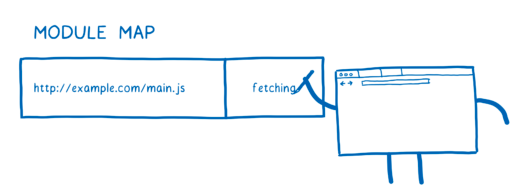
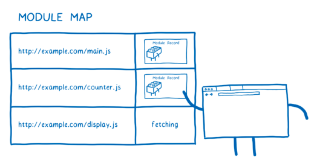
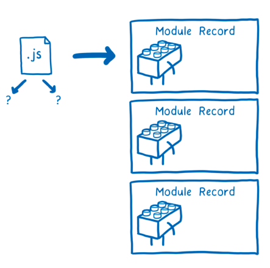
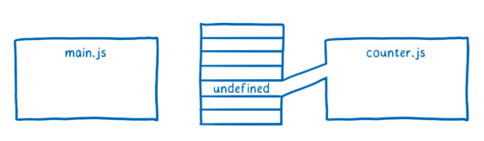

```
해당 글은 https://hacks.mozilla.org/2018/03/es-modules-a-cartoon-deep-dive/ 글 기반으로 작성되었습니다.
```

<br/>

### 모듈이 어떠한 문제를 해결하는가?!

javascript로 코드를 작성할때 변수를 선언하거나 변수를 가지고 어떠한 코드를 작성하거나 변수에 값을 할당하거나 즉, 변수 관리를 해본적이 있으실겁니다.

잘 생각해보면 코드를 작성하는 과정 대부분은 변수를 변경하는 것입니다. 그러므로 이러한 변수를 어떻게 구성하는지가 코드를 작성하는 능력이나 코드 유지 관리 능력에 큰 영향이 미칩니다.

자바스크립트에서 변수 관리를 조금 더 쉽게 해주기 위해 스코프라는 방법이 있습니다. 스코프가 동작하는 방식 때문에 함수는 다른 함수에 정의된 변수에 접근할 수 없습니다.


이러한 동작 방식 때문에 하나의 함수를 작업할 때 그 함수 하나만 생각하면 되기 때문에 다른 함수가 변수에 어떤 영향을 미칠지 걱정할 필요가 없습니다.

하지만 이러한 스코프때문에 단점도 있습니다. 서로 다른 함수간에 변수를 공유하기 어렵다는 점입니다. 변수를 스코프 외부에서 공유하기 위해서 가장 일반적인 방법은 해당 공유하려는 변수를 전역 스코프와 같이 상위 스코프에 배치하는 것입니다.

공유하려는 변수가 전역 스코프 위치한다고 가정을 한다면 이로 인해 코드 유지 관리가 까다로워집니다. 해당 전역 스코프 내에 있는 코드의 모든 부분이 변수를 변경할 수 있다는 점입니다. 해당 코드가 공유하는 변수를 실수로 덮어쓸 수 있는 문제가 잆습니다.

<br/>

### 모듈이 문제를 해결하는 방법

모듈은 변수와 함수를 더 잘 정리할 수 있게 변수와 함수를 그룹화 할 수 있습니다.

이렇게 하면 함수와 변수가 모듈 스코프에 포함됩니다. 모듈 스코프는 모듈의 함수 간에 변수를 공유하는 데 사용할 수 있습니다. 하지만 함수 스코프와 달리 모듈 스코프에는 다른 모듈에서도 해당 변수를 사용할 수 있는 방법이 있습니다.

모듈의 변수, 클래스 또는 함수 중 어떤 것을 사용할 수 있는지 명시적으로 지정할 수 있습니다. 이러한 다른 모듈에서 사용할 수 있게 만드는것을 `export`(내보내기)라고 합니다.


모듈간에 변수를 내보내고 가져올 수 있는 기능이 있으면 코드를 서로 독립적으로 동작할 수 있는 작은 덩어리로 나누기가 훨씬 쉬어집니다. 그런 다음 레고 블록처럼 이러한 코드 조각을 결합하여 사용할 수 있습니다.

현재 활발하게 사용되고 있는 모듈 시스템은 두 가지입니다. CommonJS와 ESmodule이 있습니다.

<br/>

### ES modules 작동 방식

모듈로 개발할 때는 종속성 그래프를 작성합니다. 서로 다른 종속성 간의 연결은 사용하는 모든 `import`문에서 비롯됩니다.

이러한 `import`문은 브라우저나 Node.js가 로드해야 하는 코드를 정확히 파악하는 방법입니다. 그래프의 시작점으로 사용할 파일을 제공하면 됩니다. 거기서부터 `import`문을 따라 나머지 코드를 찾으면 됩니다.


그러나 이러한 파일 자체는 브라우저에서 사용할 수 있는 것이 아닙니다. 브라우저는 이러한 모든 파일을 파싱하여 Module Record라는 데이터 구조로 변환해야 합니다. 그래야만 파일에서 실제로 무슨 일이 일어나고 있는지 알 수 있습니다.


그리고 Module Record를 모듈 인스턴스로 전환해야 합니다. 인스턴스는 코드와 상태라는 두 가지를 결합합니다.

코드는 하나의 지침입니다. 무언가를 만드는 방법에 대한 레시피와 같습니다. 하지만 코드만으로 아무것도 할 수 없습니다. 그 지침과 함께 사용할 재료가 필요합니다.

상태는 위에서 말한 재료를 제공합니다. 상태는 특정 시점의 변수의 실제 값입니다. 이러한 변수는 값을 저장하는 메모리에 대한 별칭일 뿐입니다.

정리하면, 모듈 인스턴스는 코드(명령어 목록)와 상태(모든 변수의 값)를 결합니다.


결록적으로 진짜로 필요한것은 각 모듈에 대한 모듈 인스턴스입니다. 모듈 로딩 프로세스는 진입점(entry point)파일에서 모듈 인스턴스의 전체 그래프를 갖는 것으로 진행됩니다.

ES module에서는 해당 작업을 세 단계로 진행됩니다. 각 단계는 다음과 같습니다.

1. Construction(구성) - 모든 파일을 찾아서 다운로드하고 Module Record로 구문 분석을 합니다.
2. Instantiation(인스턴스화) - 메모리에서 내보낸 모든 값을 메모리 위치를 찾습니다. 그런 다음 `exports`와 `import` 모두 해당 메모리 위치를 가리키도록 합니다. 이를 연결이라고 합니다.
3. Evaluation(평가) - 코드를 실행하여 변수의 실제 값으로 해당 메모리 위치를 채웁니다.


ES module은 비동기적이라고 이야기 할 수 있습니다. 작업이 로드, 인스턴스화, 평가라는 세 가지 단계로 나뉘고 각 단계가 개별적으로 수행될 수 있기 때문에 비동기적이로 생각할 수 있습니다.

여기서 잠깐 CommonJS 이야기를 하면 CJS는 모듈과 그 아래의 종속성이 중간에 중단 없이 한번에 로드, 인스턴스화, 평가 됩니다.

그러나 단계 자체가 반드시 비동기식일 필요는 없습니다. 동기식으로 수행될 수도 있습니다. 로딩을 수행하는 항목에 따라 다릅니다. 모든 것이 ES 모듈 사양에 의해 제어되는 것은 아니기 때문입니다. 실제로 작업에는 서로 다른 사양이 적용되는 두 가지 반쪽이 있습니다.

ES Module Spec(사양)에는 파일을 모듈 레코드로 구문 분석하는 방법과 해당 모듈을 인스턴스화 및 평가하는 방법이 나와 있습니다. 그리고 HTML Spec(사양)에는 파일을 가져오는 로더와 관련된 사양이 나와 있습니다.


로더는 모듈이 로드되는 방식을 제어합니다. ES module 메서드인 `ParseModule, Module.Instaniate, Module.Evaluate`를 호출합니다.


---

**각 단계에 대해여 조금 더 자세히 살펴보겠습니다.**

---

### Construction (구성)

구성 단계에서는 세 가지 일을 합니다.

1. 모듈이 포함된 파일을 어디에서 다운로드할지 파악합니다.
2. URL에서 다운로드하거나 파일 시스템에서 로드하여 파일을 가져옵니다.
3. 파일을 Module Record로 파싱합니다.

#### 파일 찾기 및 가져오기

로더가 파일을 찾아서 다운로드하는 작업을 처리합니다. 먼저 진입점(entry point) 파일을 찾아야 합니다. HTML에서는 스크립트 태그를 사용하여 로더에 파일을 찾을 위치를 알려줍니다.


자바스크립트가 직접적으로 의존하는 다음 모듈을 찾기 위해서는 `import`문을 이용하여 로더에게 다음 모듈을 찾을 수 있는 위치를 알려줍니다.


하나의 파일을 구문 분석한 다음 종속성을 파악한 다음 종속성을 찾아 로드하는 방식으로 진행됩니다.


브라우저에서는 모든 파일을 각각을 다운로드할 때까지 메인 스레드를 차단하지 않습니다. 이런 메인 스레드를 차단하게 된다면 실제로 애플리케이션에서 모듈을 사용하기엔 너무 느릴 것입니다. 이러한 이유 때문에 ES module에서 구성, 인스턴스화, 평가 단계로 나눠놓은 이유입니다.

그래서 여러 단계로 분할하는 이 접근 방식은 ES module과 CommonJS 모듈의 주요한 차이점 중 하나입니다.

CommonJS는 파일 시스템에서 파일을 로드하는 것이기 때문에 인터넷을 통해 다운로드하는 것보다 훨씩 적은 시간이 걸리기 때문에 Nodejs는 파일을 로드하는 동안 메인 스레드를 차단할 수 있습니다. 그리고 파일이 이미 로드되었기 때문에 인스턴화 및 평가만 화면 됩니다. 즉, CommonJS에서는 별도의 단계로 분할하지 않습니다. 파일에 대한 모든 종속성을 로드, 인스턴스화 및 평가하면서 전체 종속성 트리를 따라 진행됩니다.


CommonJS 모듈이 있는 Nodejs에서는 해당 모듈에 주소를 입력하는 부분(`require("여기")`)에 변수를 사용할 수 있다는 것입니다. 다음 모듈을 찾기 전에 이 모듈의 모든 코드를 실행하기 때문입니다. 즉, 모듈 확인을 수행할 때 변수에 값을 갖게 됩니다.

하지만 ES module을 사용하면 평가를 수행하기 전에 전체 모듈 그래프를 미리 작성하게 됩니다. 즉, 변수에 아직 값이 없기 때문에 주소를 입력하는 부분( `from 여기` )에 변수를 넣을 수 없습니다.


그러나 때로는 모듈 경로에 변수를 사용하는 것이 유용할 때가 있습니다. 예를 들어 코드가 수행하는 작업이나 실행 중인 환경에 따라 로드하는 모듈을 전환하고 싶을 때 Dynamic import(동적 가져오기)라는 방법이 있습니다. 이 기능을 사용하면 `import(${path}/foo.js)`와 같은 import 문을 사용할 수 있습니다.

이러한 동적 가져오기가 동작하는 방식은 `import()`를 사용하여 로드된 모든 파일이 별도의 그래프의 진입점으로 처리된다는 것입니다. 동적으로 가져온 모듈은 새 그래프를 시작하여, 이 그래프는 별도로 처리됩니다.


파일을 다운로드하는 로더는 가져온 모듈를 캐시합니다. 예를 들어 어떤 모듈 파일이 여러 모듈에 종속되어 있어도 한 번만 가져올 수 있습니다. 로더는 모듈 맵이라는 것을 사용하여 이 캐시를 관리합니다. 로더가 URL을 가져올 때 모듈 맵에 해당 URL을 저장하고 현재 파일을 가져오고 있다는 메모를 남깁니다. 그런 다음 요청을 전송하고 다음 파일 가져오기를 시작합니다.



다른 모듈이 동일한 파일에 종속되어 있으면 로더는 모듈 맵에서 각 URL을 조회합니다. 모듈 맵에서 해당 URL이 존재하면 다음 URL로 넘어갑니다.

#### Parsing(구문 분석)

이제 파일을 가져왔으니 모듈 레코드로 파싱해야 합니다. 이렇게 하면 브라우저가 모듈의 여러 부분을 이해하는 데 도움이 됩니다.


모듈 레코드가 생성되면 모듈 맵에 배치됩니다. 즉, 앞으로 요청이 있을 때마다 로더가 해당 모듈 맵에서 가져올 수 있습니다.



파싱에는 매우 큰 영향을 미치는 세부 사항이 하나 있습니다. 모든 모듈은 상단에 "use strict"(엄격 모드)가 있는 것처럼 파싱됩니다.

파싱을 시작하기 전에 어떤 종류의 파일(모듈인지 아닌지)을 파싱할지 알아야 합니다. 예를 들어 브라우저에서는 스크립트 태그에 `type="module"`을 입력하기만 하면 됩니다. 브라우저에 이 파일을 모듈로 파싱해야 함을 알립니다.


그러나 Nodejs 에서는 HTML 태그를 사용하지 않으므로 유형 속성을 사용할 수 있는 옵션이 있습니다. 이 문제를 해결하기 위해 시도한 한 가지 방법은 `.mjs` 확장자를 사용하는 것입니다. 이 확장자를 사용하면 Nodejs에 "이 파일은 모듈입니다"라고 알려줍니다.

로딩 프로세스(파일을 다운로드 하는 과정)이 끝나면 진입점 파일만 있던 상태에서 Module Record가 가득 채워진 상태로 바뀌게 됩니다.



다음 단계는 이 모듈을 인스턴스화하고 모든 인스턴스를 서로 연결하는 것입니다.

### Instantiation (인스턴스화)

이전에 언급했듯이 인스턴스는 코드와 상태를 결합합니다. 상태는 메모리에 존재하므로 인스턴스화 단계에서는 메모리와 연결하는 작업이 전부입니다.

JS엔진이 모듈 환경 레코드를 생성합니다. 이 레코드는 모듈 레코드의 변수를 관리합니다. 그런 다음 메모리에서 모든 내보내기에 대한 메모리 주소를 찾습니다. 메모리에 있는 이러한 주소는 아직 값을 가져오지 않습니다. 실제 값이 채워지는 것은 평가단계 후에야 가능합니다.

모듈 그래프를 인스턴스화하기 위해 엔진은 그래프의 맨 아래, 즉 다른 것에 종속되지 않는 맨 아래에 있는 종속성까지 내려가서 해당 내보내기를 설정합니다.


엔진은 모듈이 의존하는 모든 내보내기를 연결하는 작업을 완료합니다. 그런 다음 다시 한 단계 위로 올라와 해당 모듈의 가져오기를 연결합니다. 내보내기와 가져오기는 모두 메모리에 동일한 위치를 가리킵니다.


CommonJS에서는 내보낼 때 전체 내보내기 객체가 복사됩니다. 즉, 내보내는 모든 값(예: 숫자)은 복사본이 됩니다. 내보내는 모듈이 나중에 해당 값을 변경해도 가져오는 모듈은 해당 변경 사항을 볼 수 없습니다.


이와 대조적으로 ES module은 라이브 바인딩이라는 것을 사용합니다. 두 모듈 모두 메모리에 동일한 위치를 가리킵니다. 즉, 내보내는 모듈에서 값을 변경하면 해당 변경 사항이 가져오기 모듈에 표시됩니다.


라이브 바인딩을 사용하는 이유는 코드를 실행하지 않고도 모든 모듈을 연결할 수 있기 때문입니다.

이 단계가 끝나면 모든 인스턴스와 내보내기/가져온 변수의 메모리 위치가 연결됩니다.

다음 단계는 코드 평가를 시작하고 해당 메모리 위치를 해당 값을 채울 수 있습니다.

### Evaluation (평가)

마지막 단계는 각 메모리의 위치에 값을 채우는 단계입니다. JS 엔진은 최상위 코드를 실행하여 이 작업을 수행합니다.


평가는 수행 횟수에 따라 다른 결과를 가져올 수 있으므로 단 한 번만 평가해야 합니다. 이것이 모듈 맵이 필요한 이유 중 하나입니다. 모듈 맵은 각 모듈에 대해 하나의 모듈 레코드만 존재하도록 URL로 모듈을 캐시합니다. 이렇게 하면 각 모듈이 한 번만 실행됩니다.

서로 다른 모듈이 서로 가리키는 순환 참조 현상이 발생할 수도 있습니다.


이것이 CommonJS 모듈에서 어떻게 작동되는지 살펴보겠습니다. 먼저 main 모듈이 require 문까지 실행됩니다. 그런 다음 counter 모듈을 로드합니다.


그러면 counter 모듈이 내보내기 객체에서 메세지에 접근하려고 시도합니다. 하지만 아직 main 모듈에서 평가되지 않았기 때문에 정의되지 않은 상태로 반환됩니다. JS 엔진은 로컬 변수를 위한 메모리 공간을 할당하고 값을 정의되지 않은 것으로 설정합니다.



평가는 counter 모듈의 최상위에서 코드 끝까지 계속됩니다. main 모듈이 평가된 후 메시지에 대한 올바를 값을 얻을 수 있는지 확인하고 싶기 때문에 타임아웃을 설정합니다. 그런 다음 main 모듈에서 평가가 다시 시작됩니다.


메세지 변수가 초기화되고 메모리에 추가됩니다. 그러나 둘 사이에 연결이 없으므로 필요한 모듈에서 정의되지 않은 상태로 유지됩니다.


라이브 바인딩을 사용하여 내보내기가 처리되었다면 counter 모듈은 결국 올바른 값을 보게 될 것입니다. `setTimeout`이 실행될 때 쯤이면 main 모듈의 평가가 완료되어 값이 채워졌을 것입니다.

이러한 사이클을 지원하는 것이 ES module 설계의 큰 이유입니다. 이 3단계 설계가 이를 가능하게 합니다.

<br/>

### 참조

---

https://hacks.mozilla.org/2018/03/es-modules-a-cartoon-deep-dive/
