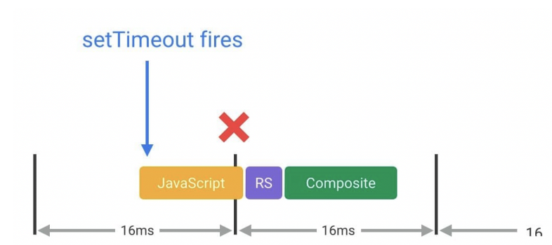

이번글에서는 requestAnimationFrame에 대하여 알아보겠습니다. 

### 프레임

일단 requestAnimationFrame을 알아보기전에 프레임이 어떤것인지부터 살펴보겠습니다. 예를 들어 영화나 애니메이션을 보는 것은 사실 짧은 시간 간격에 이어지는 장면을 보는 것입니다. 이 각각의 장면을 frame이라고 합니다. 즉, 프레임은 한 장의 사진이라 봐도 무방할것 같습니다. 그리고 fps는 frame per second의 약자이며 뜻은 특정 시간 내에 보여지는 프레임의 갯수라고 알고 계시면 좋을것 같습니다. 

보통 사람의 눈은 1초에 60개의 프레임을 넘어야가 부드럽게 인지한다고 합니다. 즉, 초당 60번의 장면을 보여준다는 의미입니다. 

브라우저에서 부드러운 애니메이션 효과를 주기 위해선 이전에 설명했듯이 초당 60개의 프레임을 렌더링을 해야합니다. 즉, 16.6밀리초 간격으로 프레임을 보여주어야 한다는것을 의미합니다.

**정리하면 자바스크립트로 사용자에게 부드러운 애니메이션을 구현하려면 16.6밀리초 마다 애니메이션 로직을 호출하는 식으로 구현해야합니다.**

<br />

### 타이머 함수로 애니메이션 구현

`setInterval`과 `setTimeout` 을 이용하여 60fps에 맞게 구현하려면 아래 예시 코드처럼 할 수 있습니다.

```javascript
const animationLogic = () => {
  // 애니메이션 로직
};

setInterval(animationLogic, 1000 / 60);
```

```javascript
const animationLogic = () => {
  // 애니메이션 로직
  
  setTimeout(animationLogic, 1000 / 60);
};

setTimeout(animationLogic, 1000 / 60);
```

하지만 이렇게 타이머 함수를 이용하게 되면 문제가 있습니다. `setInterval`과 `setTimeout` 의 문제점은 주어진 시간내에 동작할 뿐 *프레임을 신경 쓰지*  않는다는 점입니다. 즉, 타이머 함수는 프레임 단위로 프레임 시작 시간에 맞춰 실행하는것을 보장하지 못합니다.



16밀리초 간격으로 프레임 단위가 진행되어야 하는데, 브라우저가 다른 작업 수행으로 인해 16밀리초가 지난 시점에서 실행될수도 있다는 뜻입니다. 이러한 일이 발생하는 이유는 `setInterval`과 `setTimeout` 로 애니메이션 작업을 수행하면 webAPI를 통해 주어진 시간 간격으로 해당 작업을 마친뒤 `Task queue`에 해당 작업이 추가되고나서 콜 스택에 다른 작업이 존재하면 실행될 수 없고 콜 스택이 비어져있을때만 해당 작업이 실행될 수 있기 때문입니다. 

###  **requestAnimationFrame**

requestAnimationFrame은 브라우저가 렌더링하는 빈도 60fps에 맞춰서 실행됩니다. 이 말은 초당 60프레임 단위를 조금 더 보장 해준다는 의미입니다. 

**정리하면 실제 화면이 갱신되어 표시되는 주기에 따라 함수를 호출해주기 때문에 프레임 시작시 실행되도록 보장해주어 setTimeout, setInterval 과 같이 밀림 현상을 방지해줍니다.**

```javascript
requestAnimationFrame(callback)
```

- 브라우저에게 수행하기를 원하는 애니메이션 작업을 알리고 다음 리페인트 바로 전에 브라우저가 애니메이션을 업데이트할 함수를 요청합니다. 
- callback함수의 실행 횟수는 보통 1초 60회지만, 일반적으로 대부분의 웹 브라우저에서는 디스플레이(화면, 모니터) 주사율과 일치됩니다. 
- 배터리 수명과 성능 향상을 위해 대부분의 브라우저에서 백그라운드 탭들이나 숨겨진 iframe 태그들이 실행될 때 중단됩니다.
- 

<br />

###  **requestAnimationFrame** 장점

#### 백그라운드 동작 중지

`setInterval` 같은 경우 브라우저의 다른 탭 화면을 보거나 브라우저가 최소화되어 있을 때 타이머가 진행되어 작업이 진행되기 때문에 시스템 리소스 낭비 및 불필요한 전력을 소모하게 됩니다.

그러나 requestAnimationFrame은 페이지가 비활성화 된 상태이면 페이지 화면 그리기 작업도 브라우저에 의헤 일시 중지됨으로 CPU 리소스나 배터리 수명을 낭비하지 않게 됩니다. 

#### **프레임이 디스플레이 주사율에 맞게 진행**

브라우저는 디스플레이의 주사율에 따라서 만약에 모니터 144hz 이면 1초에 144번 requestAnimationFrame의 등록된 작업이 진행됩니다.

#### Animation frame 큐

requestAnimationFrame은 일반적인 `task queue` 가 아닌 `animation frame` 큐에서 처리됩니다. `animation frame` 큐는 `task queue` 보다 우선순위를 갖고 있습니다. 

`animation frame` 은 브라우저의 렌더링 엔진이 다음 프레임을 그리기 전에 실행해야 하는 requestAnimationFrame에 등록한 작업들을 담는 큐입니다. requestAnimationFrame도 브라우저의 CPU나 GPU 사용량 여부 등에 따라 콜백 함수 실행이 밀릴 수도 있습니다.

<br/>

### requestAnimationFrame 적용하는 방법

requestAnimationFrame을 아래코드처럼 callback 함수에 원하는 작업을 등록하여 사용합니다. 그리고 프레임 단위로 동작하기 때무에 별도의 시간을 입력하지 않아도 됩니다.

```javascript
const animationLogic = () => {
  // 애니메이션 로직
  
  requestAnimationFrame(animationLogic);
};

requestAnimationFrame(animationLogic);
```

requestAnimationFrame을 취소하는 방법으로는 cancelAnimationFrame을 사용하면됩니다.

```javascript
const animationLogic = () => {
  // 애니메이션 로직
  
  // 취소
  cancelAnimationFrame(raf);
  
  requestAnimationFrame(animationLogic);
};

requestAnimationFrame(animationLogic);
```

<br/>

#### 간단하게 requestAnimationFrame 정리 하면 다음과 같습니다.

- 브라우저에서 최적화할 수 있으므로 애니메이션이 더 부드러워집니다.
- 비활성 탭의 애니메이션이 중지되어 CPU의 자원 낭비 감소합니다.
- 배터리 친화적

<br/>

### 참조 

---

https://inpa.tistory.com/entry/%F0%9F%8C%90-requestAnimationFrame-%EA%B0%80%EC%9D%B4%EB%93%9C

https://css-tricks.com/using-requestanimationframe/

https://dev.to/moyedx3/10-settimeout-setinterval-and-requestanimationframe-1io4

https://developer.mozilla.org/ko/docs/Web/API/window/requestAnimationFrame
